# ⚔️ AeroBlades: 3D-Printed FPV Cruiser Fleet & Hybrid VTOL Systems

[](#)
[](https://www.rcgroups.com/forums/member.php?u=50692)
[](https://www.rcgroups.com/forums/showthread.php?4223695-Rifter-Sabre-Scimitar-mini-sized-FPV-cruisers)
[](#-master-fleet-comparison-matrix)
[](#-standardized-slicing-profiles-cheat-sheet)

> **AeroBlades** is a unified hangar, master catalog, and flight guide for the high-performance family of 3D-printed mini-sized FPV cruisers and experimental hybrid VTOL aircraft designed by **Olivier_C** on [RCGroups](https://www.rcgroups.com/forums/showthread.php?4223695-Rifter-Sabre-Scimitar-mini-sized-FPV-cruisers).
>
> Inspired by the distinctive bladed weapons that give each airframe its name (*Urumi, Sabre, Scimitar, Sica, and Rifter*), **AeroBlades** standardizes all CAD models, 3D printing stage files, BOMs, slicing presets, and flight logs into a single comprehensive repository.
>
> Every project in this repository is organized into a standardized, production-ready directory layout:
> * 🖨️ **`3D_Print_Files/`**: Categorized by assembly stage (`01_Fuselage`, `02_Wings`, `03_Tail_and_Stabs` / `Nacelles`, `04_Internal_Plates`, `05_Canopy`, `Extras`).
> * 📐 **`CAD_Source_STEP/`** or **`CAD_Source_Fusion/`**: Parametric STEP and native Fusion 360 (`.f3d`) files for custom CAD modifications.
> * 🖼️ **`media/`**: High-resolution photography of assembled airframes and slicer bed placement guides.
> * 📊 **`*.ods`**: Master spreadsheets with print times, gram weights, and layer profiles.
> * 📦 **`archives/`**: Original source zip distribution packages preserved as pristine backups.

---

## ⚡ Quick Navigation

1. [📊 Master Fleet Comparison Matrix](#-master-fleet-comparison-matrix)
2. [🛸 Urumi](#1-urumi-experimental-hybrid-vtol--quadplane) — Experimental quad-motor tailsitter VTOL / Interceptor (571g)
3. [🛩️ Mini Rifter](#2-mini-rifter-ultra-compact-fpv-cruiser) — Ultra-compact single-pusher cruiser (314g)
4. [🛩️ Rifter 3](#3-rifter-3-high-endurance-v-tail-cruiser) — Third-generation long-endurance cruiser (430g)
5. [🗡️ Sabre](#4-sabre-high-speed-twin-tractor-plank) — Twin-tractor high-speed plank (476g)
6. [🦅 Scimitar 3](#5-scimitar-3-swept-wing-flying-wing) — Third-generation swept flying wing (438g)
7. [⚔️ Sica](#6-sica-flagship-twin-tractor-heavy-cruiser) — Flagship twin-tractor heavy cruiser with COB LEDs (746g)
8. [📦 Common Hardware Ecosystem](#-common-hardware-ecosystem) — SCM camera mounts, DJI O3 cages, canopy spring locks
9. [🔩 Fleet-Wide Carbon Spar Procurement Matrix](#-fleet-wide-carbon-spar-procurement-matrix)
10. [🖨️ Standardized Slicing Profiles Cheat Sheet](#-standardized-slicing-profiles-cheat-sheet)
11. [📂 Repository Directory Structure](#-repository-directory-structure)
12. [📌 Citation & Forum Thread](#-citation--forum-thread)

---

## 📊 Master Fleet Comparison Matrix

| Aircraft | Category | Propulsion | Plastic Wt. | Print Time | Carbon Spars | Controls | Best Suited For | Files / Project |
| :--- | :--- | :--- | :---: | :---: | :--- | :--- | :--- | :---: |
| [**Urumi**](#1-urumi-experimental-hybrid-vtol--quadplane) | Hybrid VTOL | Quad Motor (4× 2207–2806, 7" props) | **571 g** | 26h 30m | 4× 6×284mm | Differential Thrust (No control surfaces) | Vertical takeoff/landing, hover-to-cruise transition | [📂 `projects/Urumi/`](projects/Urumi/) |
| [**Mini Rifter**](#2-mini-rifter-ultra-compact-fpv-cruiser) | Compact Cruiser | Single Pusher (1806–2204, 4"–5" prop) | **314 g** | 19h 18m | Front: 6×600mm<br>Rear: 6×260mm | Ailerons + Stabs | Park flying, tight spaces, ultra-portability | [📂 `projects/Mini_Rifter/`](projects/Mini_Rifter/) |
| [**Rifter 3**](#3-rifter-3-high-endurance-v-tail-cruiser) | Long-Range Cruiser | Single Pusher (2207–2806, 6"–7" prop) | **430 g** | 31h 40m | Front: 8×800mm<br>Rear: 6×400mm<br>Fuselage: 2× 6×135mm | Ailerons + V-Tail | High-efficiency glide, long range, relaxed cruising | [📂 `projects/Rifter_3/`](projects/Rifter_3/) |
| [**Sabre**](#4-sabre-high-speed-twin-tractor-plank) | Fast FPV Plank | Twin Tractor (2× 1404–1806, 4"–5" props)| **476 g** | 45h 41m | Front: 6×680mm<br>Rear: 6×320mm | 2 Elevons | Low-level carving, high top speed, pitch locked | [📂 `projects/Sabre/`](projects/Sabre/) |
| [**Scimitar 3**](#5-scimitar-3-swept-wing-flying-wing)| Flying Wing | Single Pusher (2207–2306, 5"–6" prop) | **438 g** | 21h 02m | Main: 8×750mm<br>Front: 2× 6×150mm | 2 Elevons | High agility, zero fuselage drag, aerobatics | [📂 `projects/Scimitar_3/`](projects/Scimitar_3/) |
| [**Sica**](#6-sica-flagship-twin-tractor-heavy-cruiser) | Heavy Flagship | Twin Tractor (2× 2207–2806, 6"–7" props)| **746 g** | 39h 59m | Front: 8×1000mm<br>Rear: 6×700mm<br>Tail: 2× 8×330mm | Ailerons + Twin Rudders + Elevator | Max payload, gimbal mounts, night flights (COB LED) | [📂 `projects/Sica/`](projects/Sica/) |
| [**Common**](#-common-hardware-ecosystem) | Hardware Ecosystem | Modular (Canopy Locks, SCM, O3 Cages) | Variable | - | - | - | Universal hardware across all airframes | [📂 `projects/Common/`](projects/Common/) |

---

## 🛩️ Detailed Aircraft Profiles

### 1. Urumi: Experimental Hybrid VTOL / Quadplane

[](projects/Urumi/)
[](projects/Urumi/README.md)
[](projects/Urumi/Urumi.ods)

> **Urumi** is an experimental hybrid VTOL aircraft combining vertical helicopter hovering with high-speed wing-borne forward flight. Featuring four 22° dihedral wings, four brushless motors, a tilting servo camera, and **no moving control surfaces**, Urumi is steered entirely via differential thrust.

| Top View | Front View |
| :---: | :---: |
| 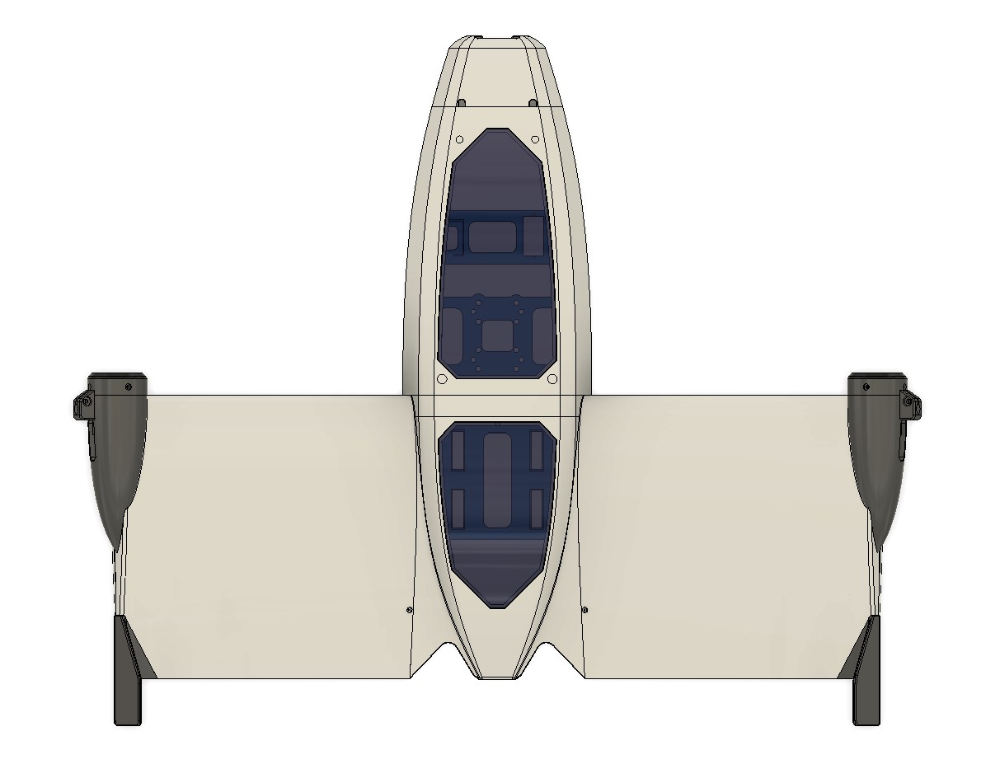 | 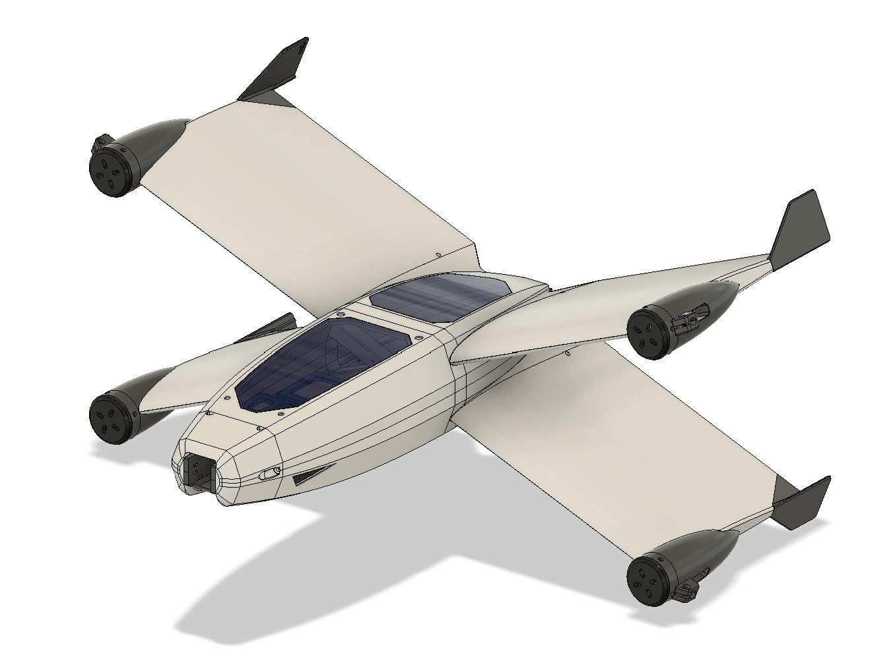 |
| **Side Profile** | **Disassembled Airframe & Removable Wings** |
| 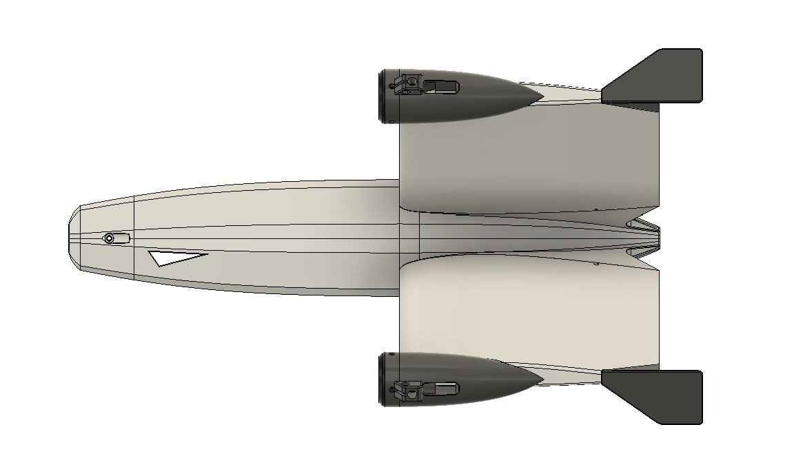 | 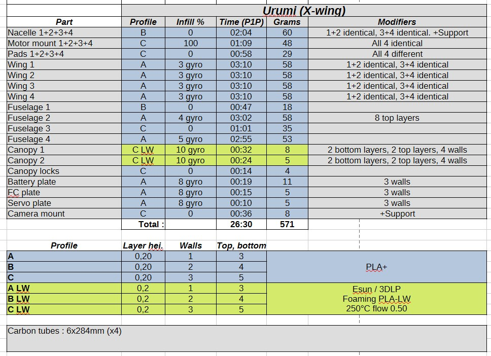 |

* **Key Specifications**:
  * **Plastic Print Weight**: 571 g (Dry weight with FPV gear: 1035 g, AUW: ~1215 g with 4S 1500mAh)
  * **Print Time**: 26h 30m (Bambu Lab P1P)
  * **Propulsion**: 4× 2207 (1800–1950KV on 4S) or 2806.5 motors with 7" propellers
  * **Battery**: 4S 1500mAh 100C LiPo (~180g)
  * **Transition Airspeed**: 70 – 80 km/h
  * **Carbon Spars Required**: 4× 6.0 mm × 284 mm (forms central X-frame)
* **Available Resources**:
  * 🖨️ **3D Print Files**: [`projects/Urumi/3D_Print_Files/`](projects/Urumi/3D_Print_Files/)
    * `01_Fuselage/` — Fuselage 1, 2, 3, 4
    * `02_Wings/` — Wing 1-2, Wing 3-4 (with mirroring)
    * `03_Nacelles_and_Mounts/` — Nacelles 1-4, Motor mounts 1-4, Landing pads 1-4
    * `04_Internal_Plates/` — Battery plate, FC plate, Servo plate, Camera mount
    * `05_Canopy/` — Canopy 1 & 2, Canopy locks
    * `Extras/` — 0.5mm tighter motor mounts, Wing roots 1-4
  * 📐 **Slicer Placement Guides**: [`projects/Urumi/media/slicer_placement/`](projects/Urumi/media/slicer_placement/) (11 bed photos)
  * 🛠️ **CAD STEP Models**: [`projects/Urumi/CAD_Source_STEP/`](projects/Urumi/CAD_Source_STEP/) (19 STEP models)
  * 📚 **In-Depth Documentation Suite**: [`projects/Urumi/docs/`](projects/Urumi/docs/)
    * [01: Hardware Electronics & Configuration Software](projects/Urumi/docs/01_HARDWARE_ELECTRONICS.md)
    * [02: Hardware Parts, Mechanical Structure & Filaments](projects/Urumi/docs/02_HARDWARE_PARTS_AND_MECHANICAL.md)
    * [03: 3D Printing Guide & Master Slicer Profiles](projects/Urumi/docs/03_PRINT_GUIDE_AND_PROFILES.md)
    * [04: Airframe Assembly & Wiring Guide](projects/Urumi/docs/04_ASSEMBLY_AND_WIRING.md)
    * [05: INAV Hybrid VTOL Flight Manual](projects/Urumi/docs/05_INAV_FLIGHT_MANUAL.md)
    * [06: Designer Flight Logs & Video Transcripts](projects/Urumi/docs/06_DESIGNER_FLIGHT_LOGS_AND_VIDEO_TRANSCRIPTS.md)
  * 🎬 **Videos**: [Part 1 (Conception)](https://www.youtube.com/watch?v=R3-GTveqTRI) | [Part 2 (Crash Investigation)](https://www.youtube.com/watch?v=sHy94xdoC1A) | [Part 3 (Wind Handling)](https://www.youtube.com/watch?v=J87EU8D0PFA)

---

### 2. Mini Rifter: Ultra-Compact FPV Cruiser

[](projects/Mini_Rifter/)
[](projects/Mini_Rifter/README.md)
[](projects/Mini_Rifter/Mini%20Rifter.ods)

> **Mini Rifter** is a scaled-down, ultra-portable edition of the Rifter cruiser platform. Designed for agile cruising, park flying, and efficient long endurance on small battery packs.

| Top View | Front View |
| :---: | :---: |
| 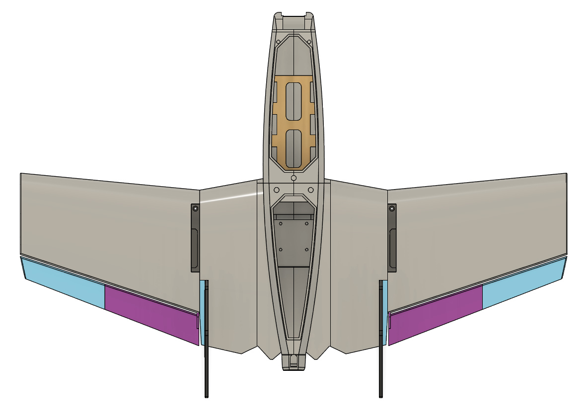 | 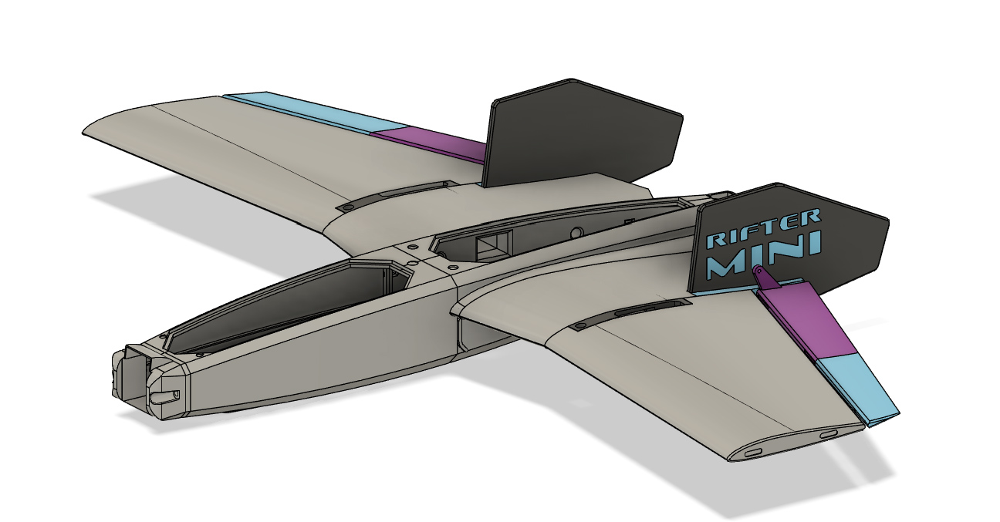 |
| **Side Profile** | **Disassembled Airframe & Parts** |
| 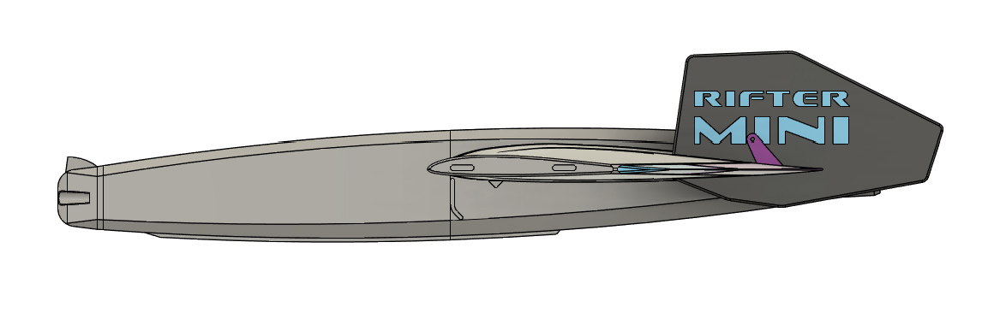 | 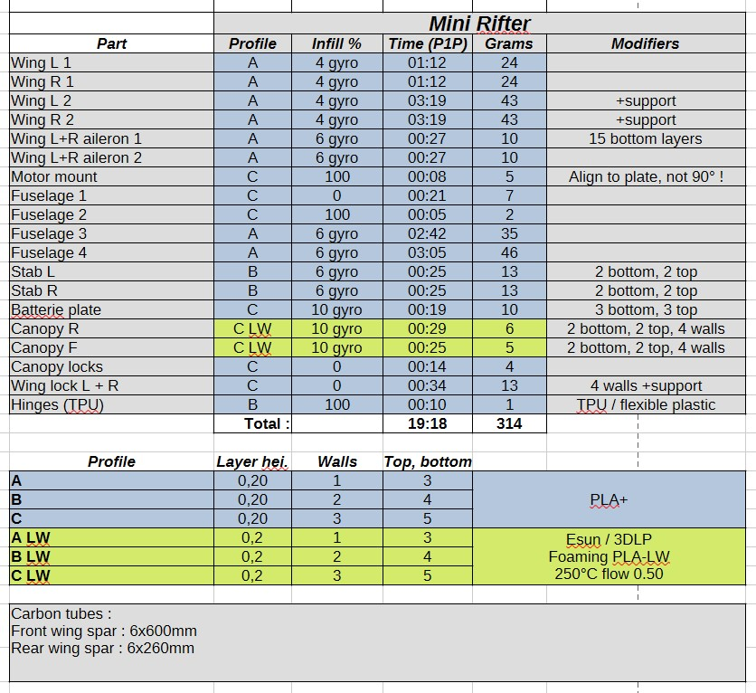 |

* **Key Specifications**:
  * **Plastic Print Weight**: 314 g
  * **Print Time**: 19h 18m (Bambu Lab P1P)
  * **Propulsion**: Single rear pusher motor (1806–2204), 4"–5" prop
  * **Battery**: 3S 18650 Li-ion pack or 3S/4S 1300–1500mAh LiPo
  * **Carbon Spars Required**: Front 6.0 mm × 600 mm, Rear 6.0 mm × 260 mm
* **Available Resources**:
  * 🖨️ **3D Print Files**: [`projects/Mini_Rifter/3D_Print_Files/`](projects/Mini_Rifter/3D_Print_Files/)
    * `01_Fuselage/` — Fuselage 1, 2, 3, 4, F3F4 pins
    * `02_Wings/` — Wings 1 & 2 (L/R), Ailerons 1 & 2 (L/R), Wing locks
    * `03_Tail_and_Stabs/` — Wing Stabs (L/R), Motor mount
    * `04_Internal_Plates/` — Battery plate, TPU hinges
    * `05_Canopy/` — Canopy F & R, Canopy locks
    * `Extras/` — SCM camera nose, no-holes nose, wingtips, external DJI O3 pod
  * 📐 **Slicer Placement Guides**: [`projects/Mini_Rifter/media/slicer_placement/`](projects/Mini_Rifter/media/slicer_placement/) (9 bed photos)
  * 🛠️ **CAD STEP Models**: [`projects/Mini_Rifter/CAD_Source_STEP/`](projects/Mini_Rifter/CAD_Source_STEP/) (16 STEP files)
  * 🎬 **Video**: [Mini Rifter Flight Test on YouTube](https://www.youtube.com/watch?v=fl-8yHl3snQ)

---

### 3. Rifter 3: High-Endurance V-Tail Cruiser

[](projects/Rifter_3/)
[](projects/Rifter_3/README.md)
[](projects/Rifter_3/Rifter3.ods)

> **Rifter 3** is the mature, third-generation evolution of the Rifter single-motor pusher cruiser. Boasting a large high-aspect-ratio wing, dedicated fuselage bays, and modular carbon reinforcement, it delivers exceptional glide ratios and long-range cruising.

| Top View | Front View |
| :---: | :---: |
| 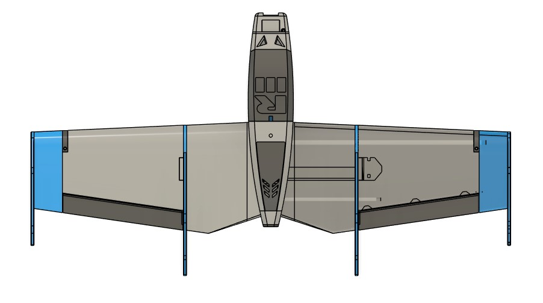 | 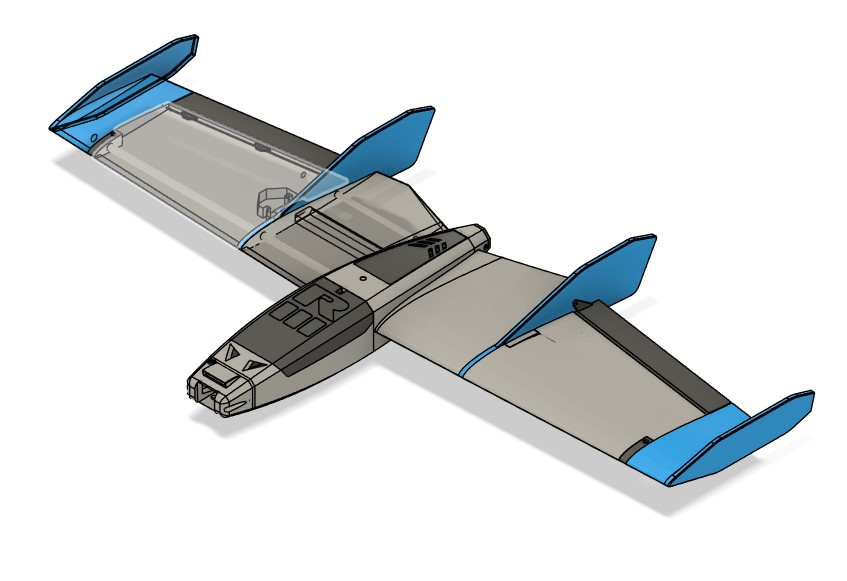 |
| **Side Profile** | **Disassembled Airframe & Parts** |
| 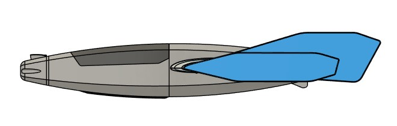 | 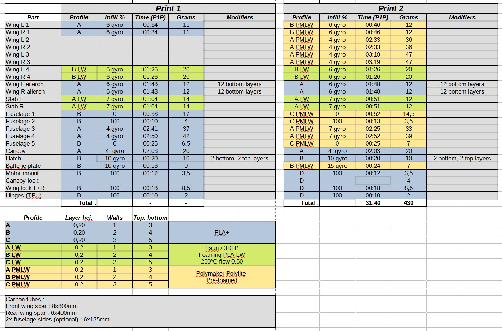 |

* **Key Specifications**:
  * **Plastic Print Weight**: 430 g
  * **Print Time**: 31h 40m (Bambu Lab P1P)
  * **Propulsion**: Single rear pusher motor (2207–2806.5), 6"–7" prop
  * **Battery**: 4S 18650 / 21700 Li-ion pack (up to 4000–5000mAh) or 4S LiPo
  * **Carbon Spars Required**: Front 8.0 mm × 800 mm, Rear 6.0 mm × 400 mm, Fuselage (optional) 2× 6.0 mm × 135 mm
* **Available Resources**:
  * 🖨️ **3D Print Files**: [`projects/Rifter_3/3D_Print_Files/`](projects/Rifter_3/3D_Print_Files/)
    * `01_Fuselage/` — Fuselage 1 to 5, Hatch
    * `02_Wings/` — Wings 1 to 4 (L/R), Ailerons (L/R), Wing locks
    * `03_Tail_and_Stabs/` — V-tail Stabs, Motor mount
    * `04_Internal_Plates/` — Battery plate
    * `05_Canopy/` — Canopy, Canopy lock
    * `Extras/` — SCM camera nose, GPS plate
  * 📐 **Slicer Placement Guides**: [`projects/Rifter_3/media/slicer_placement/`](projects/Rifter_3/media/slicer_placement/) (13 bed photos)
  * 🛠️ **CAD STEP Models**: [`projects/Rifter_3/CAD_Source_STEP/`](projects/Rifter_3/CAD_Source_STEP/) (14 STEP files)
  * 🎬 **Videos**: [Rifter 3 Flight Test](https://www.youtube.com/watch?v=L3LojPVs68U) | [Rifter 2 Historic Video](https://www.youtube.com/watch?v=LL8X9GLXXWU)

---

### 4. Sabre: High-Speed Twin-Tractor Plank

[](projects/Sabre/)
[](projects/Sabre/README.md)
[](projects/Sabre/Sabre.ods)

> **Sabre** is a fast, aggressive twin-tractor "plank" cruiser. With twin counter-rotating tractor motors mounted on wing nacelles and an un-swept plank wing layout, Sabre delivers blistering acceleration, locked-in pitch stability, and thrilling low-altitude carving.

| Top View | Front View |
| :---: | :---: |
| 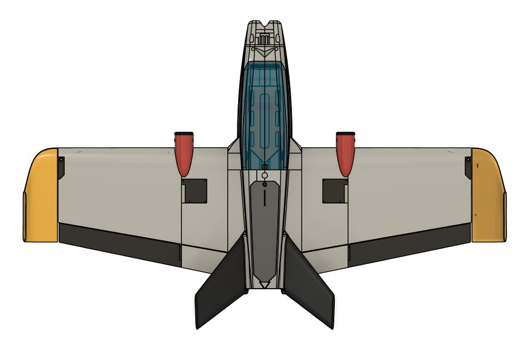 | 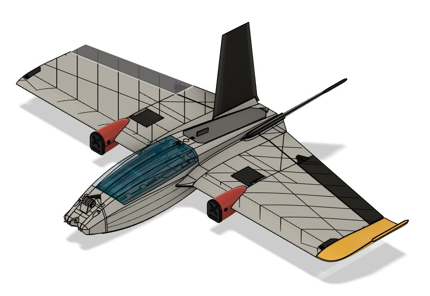 |
| **Side Profile** | **Disassembled Airframe & Parts** |
| 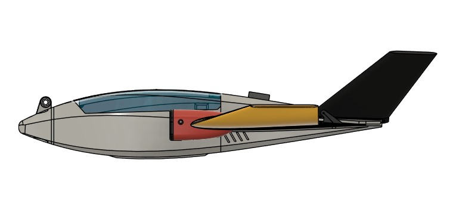 | 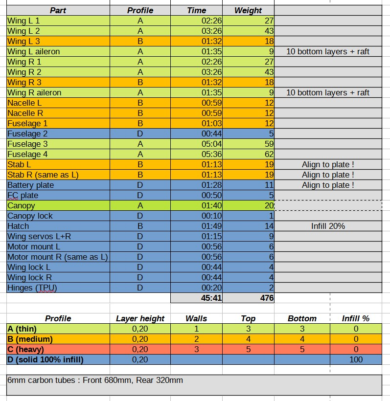 |

* **Key Specifications**:
  * **Plastic Print Weight**: 476 g
  * **Print Time**: 45h 41m (Bambu Lab P1P)
  * **Propulsion**: Twin tractor motors (2× 1404–1806), 4"–5" counter-rotating props
  * **Battery**: 4S 1500–2200mAh LiPo or 4S 18650 Li-ion pack
  * **Carbon Spars Required**: Front 6.0 mm × 680 mm, Rear 6.0 mm × 320 mm
* **Available Resources**:
  * 🖨️ **3D Print Files**: [`projects/Sabre/3D_Print_Files/`](projects/Sabre/3D_Print_Files/)
    * `01_Fuselage/` — Fuselage 1 to 4, Hatch
    * `02_Wings/` — Wings 1 to 3 (L/R), Ailerons, Locks, Servos
    * `03_Nacelles_and_Mounts/` — Nacelles (L/R), Motor mounts, Stabs
    * `04_Internal_Plates/` — Battery plate, FC plate, TPU hinges
    * `05_Canopy/` — Canopy, Canopy lock
    * `Extras/` — Dedicated GoPro nose, SCM nose
  * 📐 **Slicer Placement Guides**: [`projects/Sabre/media/slicer_placement/`](projects/Sabre/media/slicer_placement/) (21 bed photos)
  * 🛠️ **Parametric Fusion 360 Source Files**: [`projects/Sabre/CAD_Source_Fusion/`](projects/Sabre/CAD_Source_Fusion/) (18 native `.f3d` files)
  * 🎬 **Video**: [Sabre Flight Demonstration on YouTube](https://www.youtube.com/watch?v=Vm1uSv3ZKd4)

---

### 5. Scimitar 3: Swept-Wing Flying Wing

[](projects/Scimitar_3/)
[](projects/Scimitar_3/README.md)
[](projects/Scimitar_3/Scimitar3.ods)

> **Scimitar 3** is a high-performance 3D-printed swept flying wing powered by a central pusher motor. Engineered for clean laminar airflow, fast cruise speeds, and high aerobatic agility with zero fuselage drag.

| Top View | Front View |
| :---: | :---: |
| 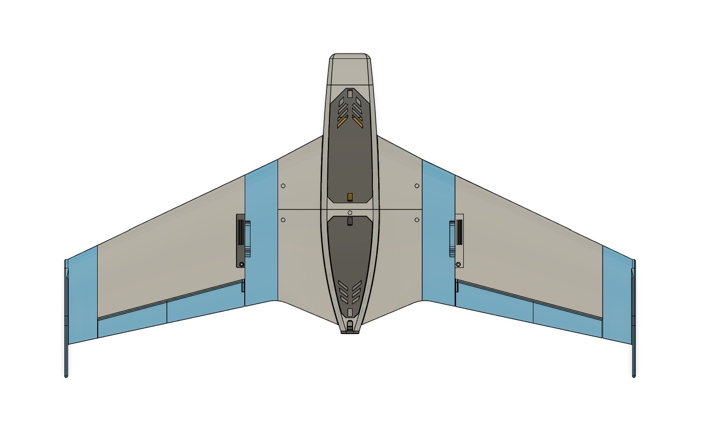 | 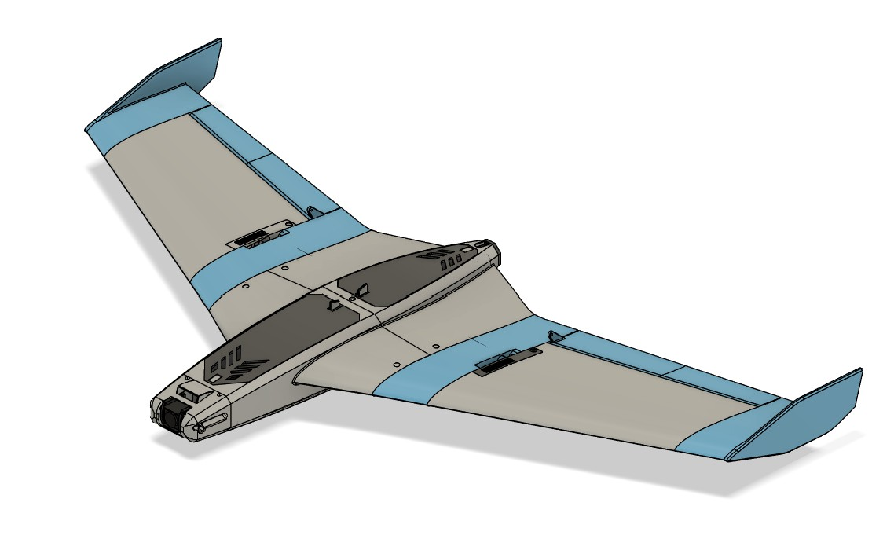 |
| **Side Profile** | **Disassembled Airframe & Parts** |
| 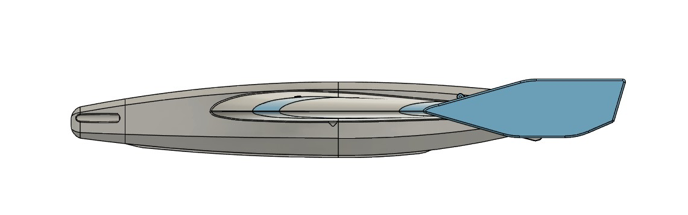 | 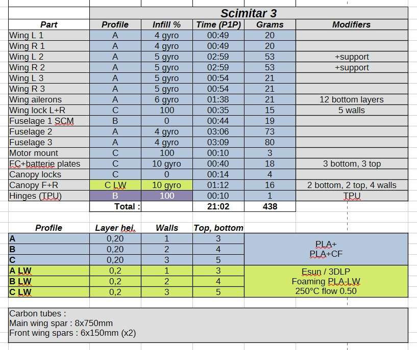 |

* **Key Specifications**:
  * **Plastic Print Weight**: 438 g
  * **Print Time**: 21h 02m (Bambu Lab P1P)
  * **Propulsion**: Single rear pusher motor (2207–2306), 5"–6" prop
  * **Battery**: 4S 1500–2200mAh LiPo or 4S 18650 Li-ion pack
  * **Carbon Spars Required**: Main wing spar 8.0 mm × 750 mm, Front wing spars 2× 6.0 mm × 150 mm
* **Available Resources**:
  * 🖨️ **3D Print Files**: [`projects/Scimitar_3/3D_Print_Files/`](projects/Scimitar_3/3D_Print_Files/)
    * `01_Fuselage/` — Fuselage 1, 1 SCM, 2, 3
    * `02_Wings/` — Wings 1 to 3 (L/R), Elevons, Wing locks
    * `03_Motor_Mount/` — Motor mount 4mm
    * `04_Internal_Plates/` — Battery plate, FC plate, TPU hinges
    * `05_Canopy/` — Canopy F & R, Canopy locks
    * `Extras/` — Extended wingtips (+25mm), centering pin, text canopies
  * 📐 **Slicer Placement Guides**: [`projects/Scimitar_3/media/slicer_placement/`](projects/Scimitar_3/media/slicer_placement/) (11 bed photos)
  * 🛠️ **CAD STEP Models**: [`projects/Scimitar_3/CAD_Source_STEP/`](projects/Scimitar_3/CAD_Source_STEP/) (10 STEP files)
  * 🎬 **Video**: [Scimitar Flying Wing Flight Demonstration](https://www.youtube.com/watch?v=LZn1OF9eK5k)

---

### 6. Sica: Flagship Twin-Tractor Heavy Cruiser

[](projects/Sica/)
[](projects/Sica/README.md)
[](projects/Sica/Sica.ods)

> **Sica** is the flagship heavy long-range cruiser of the fleet. Featuring twin forward tractor motors, a generous fuselage payload cabin, twin vertical stabilizers, and full night-flight COB LED internal channels, Sica is the ultimate endurance platform.

| Top View | Front View |
| :---: | :---: |
| 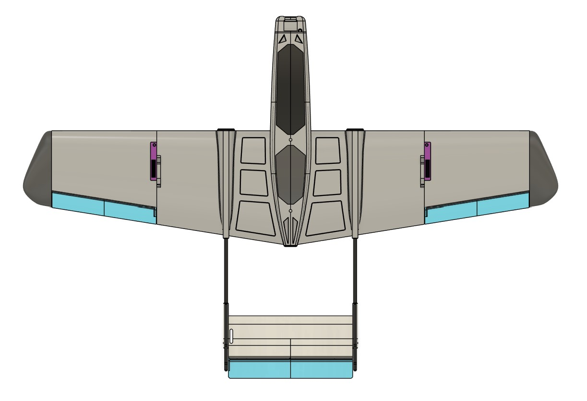 | 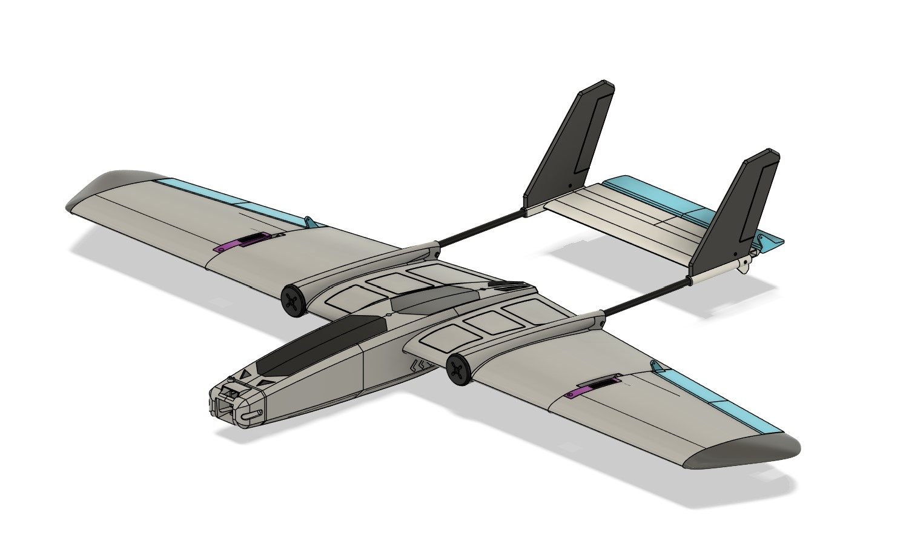 |
| **Side Profile** | **Disassembled Airframe & Parts** |
| 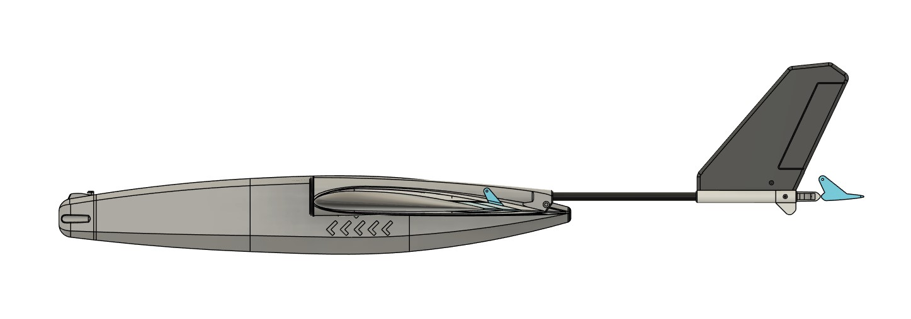 | 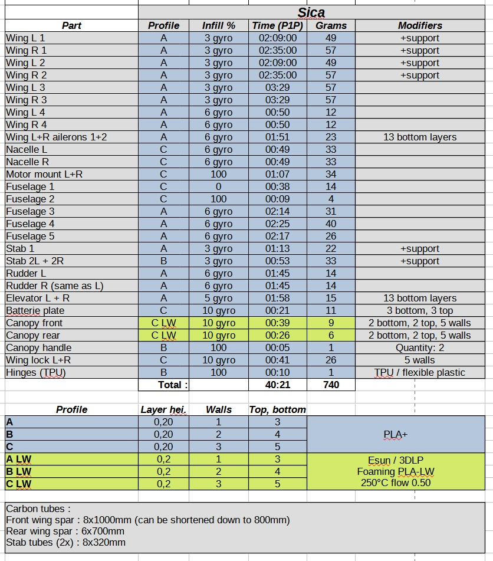 |

* **Key Specifications**:
  * **Plastic Print Weight**: 746 g
  * **Print Time**: 39h 59m (Bambu Lab P1P)
  * **Propulsion**: Twin tractor motors (2× 2207–2806.5), 6"–7" props
  * **Battery**: 4S 21700 4000–8000mAh Li-ion pack or large 4S LiPo
  * **Carbon Spars Required**: Front wing spar 8.0 mm × 1000 mm (or 800mm), Rear spar 6.0 mm × 700 mm, Tail stabs 2× 8.0 mm × 330 mm
* **Available Resources**:
  * 🖨️ **3D Print Files**: [`projects/Sica/3D_Print_Files/`](projects/Sica/3D_Print_Files/)
    * `01_Fuselage/` — Fuselage 1 to 5
    * `02_Wings/` — Wings 1 to 4 (L/R), Ailerons 1 & 2 (L/R), Wing locks
    * `03_Tail_and_Nacelles/` — Nacelles, Motor mounts, Stabs 1 & 2, Rudders, Elevators
    * `04_Internal_Plates/` — Battery plate, TPU hinges
    * `05_Canopy/` — Canopy Front & Rear, Canopy handles
    * `Extras/` — HEQ G-Port gimbal, O3 Pan/Tilt dome, COB LED suites
  * 📐 **Slicer Placement Guides**: [`projects/Sica/media/slicer_placement/`](projects/Sica/media/slicer_placement/) (20 bed photos)
  * 🛠️ **CAD STEP Models**: [`projects/Sica/CAD_Source_STEP/`](projects/Sica/CAD_Source_STEP/) (21 STEP models + `Sica v243.step`)
  * 🎬 **Videos**: [New Twin Tractor (Sica Introduction)](https://www.youtube.com/watch?v=HihsU5iFMYI) | [Neon Nights (COB LED Night Flight)](https://www.youtube.com/watch?v=hPF_NwX6mRE)

---

## 📦 Common Hardware Ecosystem

[](projects/Common/)
[](projects/Common/README.md)

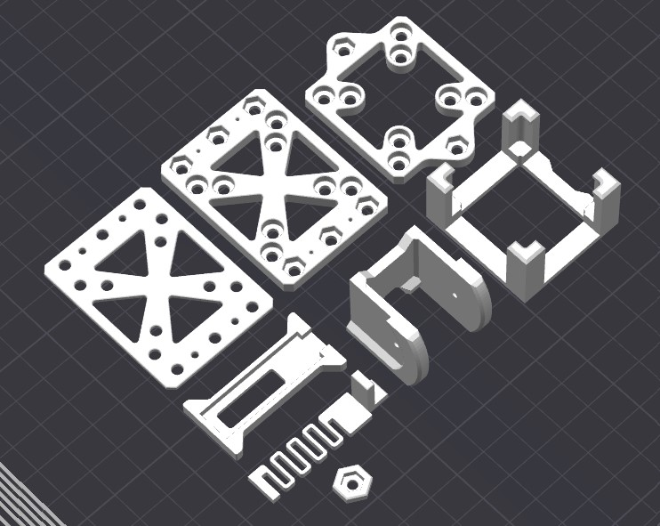

The [`projects/Common/`](projects/Common/) directory contains universal components shared across all aircraft:

1. **🔒 Canopy Spring Locks (`01_Canopy_Spring_Locks/`)**:
   Standardized tool-free snap latches (`Canopy spring Lock 1.3mf` & `2.3mf`) used on all canopies.
2. **📹 DJI O3 Air Unit Cage & Mounts (`02_DJI_O3_Mounts/`)**:
   Vibration-isolated camera cage (`DJI O3 cage 1.3mf`, `2.3mf`) and ventilated air unit VTX heatsink bracket (`DJI O3 VTX mount.3mf`).
3. **🎥 Standard Camera Mount (SCM) (`03_Standard_Camera_Mounts_SCM/`)**:
   Universal swappable nose blocks (`DJI O3 Cam mount.3mf`, `HDZero Micro Cam mount.3mf`, `Walksnail Cam mount.3mf`) for modern digital FPV cameras.
4. **⚡ Universal Flight Controller Trays & Hardware (`04_Universal_FC_Plates_and_Hardware/`)**:
   FC mounting plates (`FC plate 1-4`) and threaded M3 knurl brass insert adapters (`M3 knurl.3mf`).

---

## 🔩 Fleet-Wide Carbon Spar Procurement Matrix

This table aggregates all carbon fiber tube requirements across all aircraft, making it easy to purchase raw stock:

| Aircraft | Tube Outer Diameter | Length | Quantity Required | Purpose |
| :--- | :---: | :---: | :---: | :--- |
| **Urumi** | 6.0 mm | 284 mm | 4 | Central X-frame spars |
| **Mini Rifter** | 6.0 mm | 600 mm | 1 | Main wing spar |
| | 6.0 mm | 260 mm | 1 | Rear wing spar |
| **Rifter 3** | 8.0 mm | 800 mm | 1 | Main wing spar |
| | 6.0 mm | 400 mm | 1 | Rear wing spar |
| | 6.0 mm | 135 mm | 2 (optional) | Fuselage side stiffeners |
| **Sabre** | 6.0 mm | 680 mm | 1 | Main wing spar |
| | 6.0 mm | 320 mm | 1 | Rear wing spar |
| **Scimitar 3** | 8.0 mm | 750 mm | 1 | Main wing spar |
| | 6.0 mm | 150 mm | 2 | Forward wing spars |
| **Sica** | 8.0 mm | 1000 mm (or 800mm) | 1 | Main wing spar |
| | 6.0 mm | 700 mm | 1 | Rear wing spar |
| | 8.0 mm | 330 mm | 2 | Tail stabilizer spars |

---

## 🖨️ Standardized Slicing Profiles Cheat Sheet

All models in this fleet are tuned for 0.4mm nozzles, 0.20mm layer heights, and the standard Bambu Studio / OrcaSlicer profile conventions established by Olivier_C:

| Profile Code | Profile Name | Wall Loops | Top / Bottom Layers | Infill % & Pattern | Standard Material | Primary Use Cases |
| :--- | :--- | :---: | :---: | :---: | :--- | :--- |
| **Profile A** | Thin / Light | 1 | 3 / 3 | 3%–6% Gyroid | PLA+ / Pre-foamed LW | Wings, ailerons, main fuselage cabins |
| **Profile B** | Medium | 2 | 4 / 4 | 0%–10% Gyroid | PLA+ | Nose bays, tail cones, nacelles |
| **Profile C** | Heavy / Structural | 3 | 5 / 5 | 0% or 10% Gyroid | PLA+ | Landing pads, battery trays, wing locks, camera brackets |
| **Profile D** | Solid Retention | 3–5 | 5 / 5 | 100% Solid | PLA+ / PETG | Motor mounts, servo mounts, hinge pins |
| **Profile LW** | Active Foaming | 1–4 | 2 / 2 | 10% Gyroid | Foaming LW-PLA (250°C, 0.50 flow) | Lightweight aerodynamic canopies, tail stabs |
| **TPU** | Flexible | 2–3 | 4 / 4 | 100% Solid | Flexible TPU 95A | Integrated control surface hinges |

---

## 📂 Repository Directory Structure

```
AeroBlades/
├── README.md                                  # AeroBlades Fleet Portal, Catalog & Master Guide (this file)
│
├── 📂 projects/                               # All 7 standardized aircraft & hardware projects
│   ├── Common/                                # Shared canopy locks, DJI O3 cages, SCM mounts
│   ├── Mini_Rifter/                           # Mini Rifter cruiser files & README
│   ├── Rifter_3/                              # Rifter 3 cruiser files & README
│   ├── Sabre/                                 # Sabre twin-tractor plank files & README
│   ├── Scimitar_3/                            # Scimitar 3 swept flying wing files & README
│   ├── Sica/                                  # Sica heavy twin-tractor cruiser files & README
│   └── Urumi/                                 # Urumi hybrid VTOL files, docs & README
│
└── 📂 archives/                               # Backup storage of original release zip packages
    ├── Common.zip                             # Shared components across airframes
    ├── Mini Rifter.zip                        # Mini Rifter cruiser files
    ├── Rifter3.zip                            # Rifter 3 cruiser files
    ├── Sabre.zip                              # Sabre cruiser files
    ├── Scimitar3.zip                          # Scimitar 3 cruiser files
    ├── Sica.zip                               # Sica cruiser files
    └── Urumi.zip                              # Original Urumi release archive
```

---

## 📌 Citation & Forum Thread

The **AeroBlades** aircraft family originates from **Olivier_C**'s groundbreaking work on 3D-printed mini-sized FPV cruisers:

* **Primary Project Thread & Citation:**  
  👉 [RCGroups: Rifter, Sabre, Scimitar : mini-sized FPV cruisers](https://www.rcgroups.com/forums/showthread.php?4223695-Rifter-Sabre-Scimitar-mini-sized-FPV-cruisers)  
  *Author:* **Olivier_C** on RCGroups.com
* **Standardized Fleet Projects (`projects/`):**  
  * [`projects/Urumi/`](projects/Urumi/) — Experimental hybrid VTOL / Quadplane
  * [`projects/Mini_Rifter/`](projects/Mini_Rifter/) — Ultra-compact single pusher cruiser
  * [`projects/Rifter_3/`](projects/Rifter_3/) — Rifter Generation 3 long-range cruiser
  * [`projects/Sabre/`](projects/Sabre/) — High-speed twin-tractor plank
  * [`projects/Scimitar_3/`](projects/Scimitar_3/) — Swept flying wing
  * [`projects/Sica/`](projects/Sica/) — Flagship heavy cruiser with COB LED lighting
  * [`projects/Common/`](projects/Common/) — Shared canopy locks, DJI O3 mounts, SCM
* **Original Distribution Backups (`archives/`):**  
  The [`archives/`](archives/) directory preserves the pristine original `.zip` releases for all airframes.
