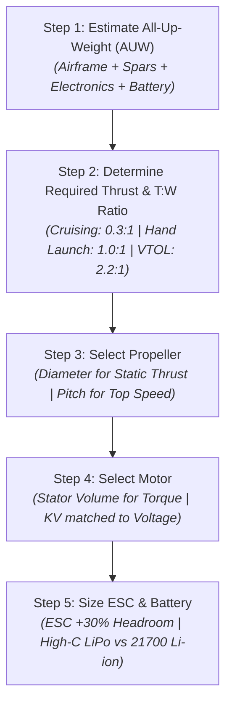
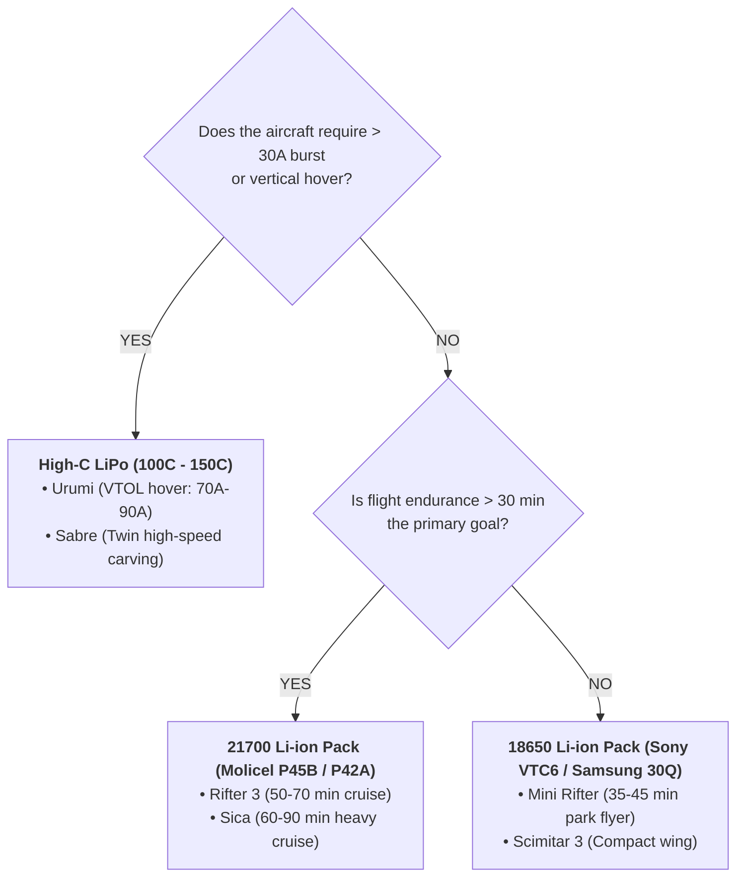

# ⚡ Guide 03: Powertrain Engineering Guide (Motor, Propeller, ESC & Battery)

Designing the propulsion and electrical power system for a 3D-printed aircraft is an engineering chain: **Weight $\rightarrow$ Required Thrust $\rightarrow$ Propeller $\rightarrow$ Motor (Stator & KV) $\rightarrow$ ESC $\rightarrow$ Battery**.

Because 3D-printed airframes have poor thermal dissipation compared to open carbon quadcopter frames, selecting under-sized motors or under-rated ESCs will cause thermal failure inside plastic bays. Conversely, over-sizing components adds unnecessary dead weight, increasing stall speed and ruining glide performance.

This guide provides the complete mathematical framework, component selection criteria, and turnkey procurement recipes for the **AeroBlades** fleet.

---

## 1. The 5-Step Powertrain Sizing Algorithm

### Step 1: Calculate Target All-Up-Weight (AUW)
$$\text{AUW} = \text{Plastic Print Weight} + \text{Carbon Spars} + \text{Electronics (FC, Servos, VTX, Cam, Rx)} + \text{Battery}$$
* *Plastic Print Weights (from master tables)*: Mini Rifter (314g), Rifter 3 (430g), Sabre (476g), Scimitar 3 (438g), Sica (746g), Urumi (571g).
* *Typical Fixed Electronics Payload*: ~120g – 180g (FC + 2–4 servos + DJI O3 + ELRS receiver + wiring).
* *Battery Weight*:
  * 4S 1500mAh 100C LiPo: ~180g – 200g
  * 4S1P 18650 Li-ion pack: ~205g
  * 4S1P 21700 Li-ion pack: ~295g – 310g

---

### Step 2: Determine Required Thrust & Thrust-to-Weight (T:W) Ratio
Unlike multirotors (which require $T:W > 1.0$ simply to lift off the ground), a fixed-wing aircraft generates lift aerodynamically from its wings:
* **Level Cruise**: Requires only **$0.2:1$ to $0.3:1$ thrust-to-weight** ratio.
* **Hand Launch & Climb-Out**: Requires at least **$0.8:1$ to $1.2:1$**.
* **High-Speed Carving & Vertical Climbs (Sabre)**: Target **$2.0:1$ to $3.0+:1$**.
* **Hybrid VTOL Hover (Urumi)**: Requires **$2.0:1$ to $2.5:1$ minimum** total thrust across all 4 motors to maintain stable hover in wind and recover smoothly from transitions.

---

### Step 3: Select Propeller (Diameter vs. Pitch)

Propellers are defined by two numbers: **Diameter $\times$ Pitch** (e.g., $7 \times 4$ inches).

#### A. Diameter (Disc Area = Static Thrust & Launch Punch)
$$\text{Static Thrust} \propto D^3 \times P \times \text{RPM}^2$$
* Larger diameter moves a larger mass of air at lower velocity, producing **higher efficiency (thrust-per-watt)** and easier hand launches.
* *Constraint*: Physical airframe clearance (fuselage boom clearance on pushers, ground clearance on landing).

#### B. Pitch (Pitch Speed = Top Airspeed)
Pitch is the theoretical forward distance the propeller advances in one revolution.
$$\text{Pitch Speed (km/h)} = \text{RPM} \times \text{Pitch (inches)} \times 0.001524$$

* **Rule of Thumb**:
  * Pitch speed must be at least **$1.5\times$ to $2.0\times$ the aircraft stall speed** ($V_{\text{stall}} \approx 30\text{--}40\text{ km/h}$).
  * For efficient cruising: Use moderate pitch ($7\times4$ or $6\times4$).
  * For high-speed planks (Sabre): Use high pitch-to-diameter ratio ($5\times5$ or $4\times4.5$).

#### C. Number of Blades (2-Blade vs. 3-Blade)
* **2-Blade Propellers (Recommended for Cruisers)**: Highest aerodynamic efficiency ($\eta \approx 75\%-82\%$). Less blade interference drag.
* **3-Blade Propellers**: Used when diameter is constrained by fuselage geometry (e.g. Mini Rifter or Scimitar) to increase disc area within a compact diameter. Produces smoother video with lower vibration harmonics.

---

### Step 4: Motor Sizing (Stator Dimensions & KV)

#### A. Stator Sizing (Torque Capacity)
Brushless motor size is defined by stator width and height in millimeters (e.g., **2207** = 22mm diameter, 7mm height):
* **1404 – 1806**: For light twin tractors (Sabre) or ultra-compact cruisers (Mini Rifter).
* **2207 – 2306**: Standard FPV motor size. Excellent power-to-weight, high availability. Ideal for Mini Rifter, Scimitar 3, Urumi.
* **2806.5 – 2807**: Heavy long-range motor. High iron volume, massive torque to swing large 7" props at low RPM without overheating. Ideal for Rifter 3, Sica, Urumi.

#### B. Motor KV Calculation
$\text{KV}$ is the theoretical RPM per Volt under zero load:
$$\text{Loaded RPM} \approx \text{Battery Nominal Voltage} \times \text{Motor KV} \times 0.80$$

| Battery Voltage | Target Propeller Size | Optimal KV Range | Typical Application |
| :---: | :---: | :---: | :--- |
| **3S (11.1V)** | 4" – 5" | **2300 – 2700 KV** | Mini Rifter (Park flyer) |
| **4S (14.8V)** | 4" – 5" | **2400 – 2800 KV** | Sabre (High-speed twin) |
| **4S (14.8V)** | 6" – 7" | **1700 – 1950 KV** | Rifter 3, Sica, Urumi (Standard efficiency) |
| **6S (22.2V)** | 6" – 7" | **1200 – 1400 KV** | Sica (Heavy long-range cruise) |

> 💡 **Why 4S/6S is More Efficient than 3S:**  
> Power is $P = V \times I$. To deliver 300 Watts on 3S requires ~27 Amps. On 6S, it requires only ~13.5 Amps. Since resistive heat loss in motor windings and wires is $P_{\text{loss}} = I^2 R$, halving the current reduces resistive heat loss by **75%**!

---

### Step 5: ESC & Battery Selection

#### A. ESC Amperage Sizing
* **The 30% Headroom Rule**: Inside 3D-printed plastic fuselages, cooling airflow is limited. If static full throttle draws 25A on the bench, use a **35A to 45A ESC**.
* **Firmware**: Use **AM32** or **BLHeli_32** with bi-directional DShot. Set PWM frequency to **24kHz or 48kHz** for smooth cruise and cooler running.
* **Low-ESR Capacitor**: Solder a 35V/50V 470µF–1000µF Low-ESR capacitor (Panasonic FR or Rubycon ZLH) directly at the ESC battery pads to suppress back-EMF spikes.

#### B. Battery Chemistry Decision Tree: LiPo vs. Li-ion

---

## 2. Complete Turnkey Powertrain Recipes by Airframe

Here are flight-tested, off-the-shelf component combinations for each aircraft in the fleet:

### 1. 🛩️ Mini Rifter (Ultra-Compact Cruiser)
* **Goal**: Ultra-quiet, long endurance park flyer.
* **Propulsion Layout**: Single rear pusher.
* **Recommended Motor**: EMAX ECO II 2204 (1900KV on 4S) or 1806 (2300KV on 3S).
* **Propeller**: Gemfan 5126 2-blade or HQProp 5x3x3 3-blade.
* **ESC**: 25A – 30A BLHeli_S / AM32 slim wing ESC.
* **Battery**:
  * *Endurance Setup*: 3S1P or 4S1P 18650 Li-ion (Sony VTC6 3000mAh, ~205g) $\rightarrow$ **35–45 min flight time**.
  * *Lightweight Setup*: 3S 1300mAh 60C LiPo (~120g) $\rightarrow$ **20 min flight time**.
* **Cruising Current**: ~4.5A – 6A at 50 km/h.

---

### 2. 🛩️ Rifter 3 (High-Endurance V-Tail Cruiser)
* **Goal**: 100km+ range, high aerodynamic glide ratio.
* **Propulsion Layout**: Single rear pusher.
* **Recommended Motor**: BrotherHobby Avenger 2806.5 (1700KV) or T-Motor F90 2806.5 (1950KV).
* **Propeller**: APC 7x4E Thin Electric or Gemfan Flash 7040 2-blade.
* **ESC**: 40A – 50A AM32 / BLHeli_32 with heatsink.
* **Battery**: 4S1P 21700 Molicel P45B (4500mAh, ~305g) $\rightarrow$ **50–70 min flight time**.
* **Cruising Current**: ~3.8A – 5.2A at 60 km/h.

---

### 3. 🗡️ Sabre (High-Speed Twin-Tractor Plank)
* **Goal**: Blistering acceleration, 120+ km/h top speed, locked-in pitch.
* **Propulsion Layout**: Twin forward tractors (Counter-Rotating: Left CW, Right CCW).
* **Recommended Motors**: 2× T-Motor F1507 (2700KV) or 2× Flywoo 1404 (2750KV).
* **Propellers**: 2× HQProp T5x3 or Gemfan 4024 (1× CW, 1× CCW).
* **ESC**: 2× 25A–35A individual ESCs or a single 4-in-1 35A mini stack.
* **Battery**: 4S 1500mAh – 2200mAh 100C LiPo (e.g., Tattu R-Line 4S 1500mAh, ~185g).
* **Cruising Current**: ~7A – 9A total; Full Throttle: ~35A total.

---

### 4. 🦅 Scimitar 3 (Swept Flying Wing)
* **Goal**: Aerobatic agility, carving turns, high climb rate.
* **Propulsion Layout**: Single central pusher.
* **Recommended Motor**: T-Motor Velox V3 2207 (1950KV on 4S) or 2306 (2400KV on 4S).
* **Propeller**: Gemfan Hurricane 51466 Tri-blade or 6042 2-blade.
* **ESC**: 35A – 45A BLHeli_32 / AM32.
* **Battery**: 4S 1800mAh 100C LiPo or 4S1P 18650 Li-ion pack.
* **Cruising Current**: ~5A – 7A at 65 km/h.

---

### 5. ⚔️ Sica (Heavy Flagship Twin Cruiser)
* **Goal**: Maximum payload capacity, twin-camera FPV, night COB LED flights.
* **Propulsion Layout**: Twin forward tractors (Counter-Rotating).
* **Recommended Motors**: 2× BrotherHobby 2806.5 (1300KV on 6S or 1700KV on 4S).
* **Propellers**: 2× APC 7x5E or 7040 Long Range (1× CW, 1× CCW).
* **ESC**: 2× 45A AM32 / BLHeli_32 ESCs with 35V 1000µF Low-ESR capacitors.
* **Battery**: 4S2P or 6S1P 21700 Molicel P45B pack (4500–9000mAh, ~600g) $\rightarrow$ **60–90 min flight time**.
* **Cruising Current**: ~6A – 8A total at 65 km/h.

---

### 6. 🛸 Urumi (Experimental Hybrid VTOL Quadplane)
* **Goal**: Vertical hover, hover-to-wing transition, no control surfaces.
* **Propulsion Layout**: 4× Brushless motors (Quad X layout on 22° dihedral wings).
* **Recommended Motors**: 4× BrotherHobby 2806.5 (1950KV on 4S) or T-Motor F80 Pro 2408 (1900KV).
* **Propellers**: 4× Gemfan 7040 2-Blade or HQProp 7x4x3 3-Blade (2× CW, 2× CCW).
* **ESC**: 4-in-1 55A–65A BLHeli_32 / AM32 ESC (e.g., SpeedyBee 55A 4-in-1).
* **Battery**: 4S 1500mAh – 2200mAh 100C–150C LiPo (Tattu R-Line or CNHL Black Series).
  * ⚠️ *Li-ion strictly prohibited*: Hover current draws 70A–90A total; Li-ion cells will instantly hit low-voltage cutoff.
* **Flight Time**: 6–8 minutes total (mix of 1.5 min hover/transition + 5 min wing cruise).

---

## 3. Practical Wiring & Connector Standard

| Current Level | Battery Connector | Main Wire Gauge | Motor Wire Gauge | Typical Use |
| :--- | :---: | :---: | :---: | :--- |
| **< 30A Continuous** | **XT30** | 16 AWG | 20 AWG | Mini Rifter (single motor) |
| **30A – 60A Continuous** | **XT60** | 14 AWG | 18 AWG | Rifter 3, Scimitar 3, Sabre |
| **60A – 120A Peak** | **XT60 / XT90** | 12 AWG | 16 AWG | Sica (Twin), Urumi (Quad VTOL) |

---

## 4. 📚 Authoritative References & Citations

1. **Battery Mooch**: *"Molicel P42A and P45B 21700 Benchmarks & Continuous Discharge Ratings"* — Independent laboratory testing verifying 45A CDR, internal resistance, and voltage sag characteristics. [[Mooch's Test Blog](https://www.e-cigarette-forum.com/forum/blog-entry/list-of-battery-tests.7436/)]
2. **Oscar Liang**: *"Why Capacitors Are Important For FPV Drones: Voltage Spikes and Filtering"* — Explains inductive back-EMF, low-ESR requirements, and Panasonic FM/FR and Rubycon ZLH capacitor sizing. [[Oscar Liang](https://oscarliang.com/capacitors-mini-quad/)]
3. **Oscar Liang**: *"Motor Size, Stator Dimensions, and KV Explained"* — Comprehensive tutorial on motor stator volume, torque vs RPM, and propeller matching. [[Oscar Liang](https://oscarliang.com/motors/)]
4. **AM32 / BLHeli_32 Architecture Documentation**: *"Sinusoidal Startup and Variable PWM Frequency for Fixed-Wing Efficiency"* — Multi-rotor and fixed-wing ESC commutation optimization. [[AM32 GitHub](https://github.com/AlkaMotors/AM32-MultiRotor-ESC-firmware)]
5. **Olivier_C**: *"Rifter, Sabre, Scimitar, Urumi Flight Logs"* — Verified real-world thrust-to-weight, current draw, and propeller sizing logs. [[RCGroups Thread #4223695](https://www.rcgroups.com/forums/showthread.php?4223695-Rifter-Sabre-Scimitar-mini-sized-FPV-cruisers)]
