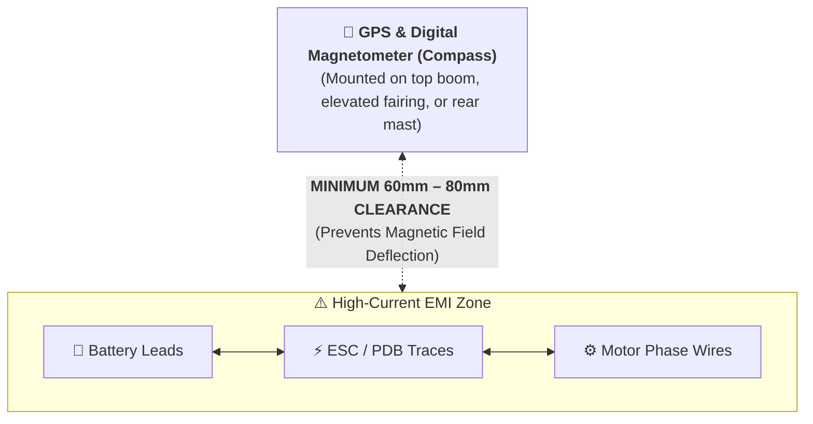
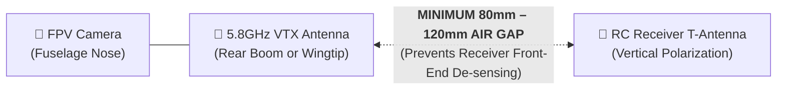

# 📡 Guide 04: Avionics, FPV & RF Integration

A 3D-printed aircraft is an RF-dense environment. With a GPS receiver, digital compass, video transmitter, radio receiver, camera, and high-current motor cables packed into a confined plastic fuselage, **electromagnetic interference (EMI)** and **RF crosstalk** can easily cause GPS lock failure, compass drift, or control link failsafes if components are not strategically laid out.

This guide provides proven avionics integration and RF separation standards for the **AeroBlades** fleet.

---

## 1. Flight Controller Selection & Mounting

| Platform | Recommended Flight Controllers | Firmware Support | Target Airframes |
| :--- | :--- | :---: | :--- |
| **Standard Wing FC** | **Matek F405-WMN / WTE**, **SpeedyBee F405 Wing** | INAV / ArduPilot | **Mini Rifter**, **Rifter 3**, **Sabre**, **Scimitar 3** |
| **Heavy / Multi-Servo**| **Matek H743-WING**, **Matek F405-WING V2** | INAV / ArduPilot | **Sica** (Twin rudders, twin ailerons, elevator, LED channels) |
| **Quadplane / VTOL** | **DakeFPV F722 VTOL / AIO**, **Matek H743-WLITE** | INAV VTOL / ArduPilot | **Urumi** (4-motor differential quadplane mixer) |

### Mounting & Vibration Isolation:
* **Never hard-mount a flight controller with rigid metal screws to printed plastic.**
* Use **M2 or M3 soft silicone anti-vibration bobbins/grommets**.
* High-frequency motor vibrations transmitted through the stiff plastic airframe can saturate the internal gyro/accelerometer (IMU), causing erratic auto-leveling and violent roll oscillations.

---

## 2. GPS & Compass (Magnetometer) Hygiene

The internal digital magnetometer (compass) measures Earth's tiny magnetic field (~0.5 Gauss). Any high-current DC wire passing nearby acts as an electromagnet ($B \propto I / r$), causing severe compass deflection whenever throttle is applied.

### Essential Rules for Compass Placement:
1. **Physical Elevation**: Mount the GPS module on the top fairing, rear tail boom, or dedicated GPS plate (as included in `projects/Common/` and `projects/Rifter_3/Extras/`).
2. **Twist Power Wires**: Tightly twist the positive and negative battery leads together. Opposing currents cancel out their external magnetic fields!
3. **Compass Calibration**: Always perform compass calibration outdoors, far away from reinforced concrete buildings, steel fences, and automobiles.

---

## 3. Digital FPV Integration (DJI O3 / Walksnail / HDZero)

Modern digital FPV systems generate crystal-clear HD video, but they introduce two distinct engineering challenges: **heat generation** and **RF noise**.

### 1. Thermal Dissipation
* The DJI O3 Air Unit and Walksnail VTX consume 10W–15W of power and quickly reach thermal throttling limits (80°C+) when stationary on the ground.
* **Standard Mounts**: Always use the ventilated brackets from [`projects/Common/02_DJI_O3_Mounts/`](../projects/Common/):
  * `DJI O3 VTX mount.3mf`: Features cooling scoops and heatsink exposure.
  * *Tip*: Avoid leaving the plane powered on the ground for more than 2 minutes before launch without active cooling or a small 5V USB fan.

### 2. Camera Jello Mitigation
* CMOS digital sensors (DJI O3, Walksnail) are vulnerable to "Jello" (horizontal rolling shutter wavy artifacts) caused by motor unbalance.
* Use the **`DJI O3 cage 1.3mf` & `2.3mf`** from `projects/Common/`, which incorporates soft rubber or TPU vibration grommets between the camera bracket and the fuselage nose.
* Balance all propellers dynamically before flight!

---

## 4. Radio Control (RC) Link & Antenna Separation

ExpressLRS (ELRS 2.4GHz / 868-915MHz) and TBS Crossfire provide extraordinary range, but antenna placement dictates link quality:

### Optimal Antenna Layout:
1. **Vertical Polarization**:
   * Mount the receiver antenna **vertically** (pointing straight up or down).
   * Most ground transmitter antennas are held vertically; matching antenna polarization avoids a **20dB signal attenuation penalty**.
2. **Frequency Separation**:
   * **2.4GHz ELRS + 5.8GHz Video**: Excellent combination with zero harmonic overlap.
   * **868/915MHz ELRS + 5.8GHz Video**: Maximum penetration and long-range immunity.
3. **Keep Antennas Off Carbon Tubes**:
   * Carbon fiber is electrically conductive and acts as an RF reflector/shield.
   * Never tape receiver or video antennas directly against carbon spars—leave at least 15mm of plastic or foam standoff.

---

## 5. Software & Autopilot Setup Checklist (INAV / ArduPilot)

Before launching any AeroBlades aircraft:

1. **Verify Control Surface Direction (MANUAL Mode)**:
   * Stick Left $\rightarrow$ Left aileron UP, Right aileron DOWN.
   * Stick Back (Pitch Up) $\rightarrow$ Elevators/Elevons UP.
2. **Verify Autopilot Correction Direction (STAB / ANGLE Mode)**:
   * Tilt plane left by hand $\rightarrow$ Flight controller must deflect left aileron DOWN (counteracting the bank).
   * Tilt nose down by hand $\rightarrow$ Flight controller must deflect elevator UP.
3. **Calibrate Current Sensor**:
   * Accurately measure consumed mAh to avoid over-discharging Li-ion packs in long-range cruise.
4. **Program Automatic Return-to-Home (RTH)**:
   * Set RTH altitude at least 30m above local trees/terrain.
   * Configure failsafe action to **RTH** instead of immediate drop.

---

## 6. 📚 Authoritative References & Citations

1. **ExpressLRS Documentation**: *"Antenna Orientation, Polarization, and Placement Best Practices"* — Outlines linear polarization alignment, diversity orthogonal placement, and conductive carbon standoff rules. [[ExpressLRS Docs](https://www.expresslrs.org/)]
2. **ArduPilot Documentation**: *"Compass Setup and Advanced Magnetic Interference Mitigation (CompassMot)"* — Physics of magnetic field deflection from high-current motor traces ($B \propto I / r$). [[ArduPilot Docs](https://ardupilot.org/copter/docs/common-compass-setup-advanced.html)]
3. **INAV Documentation**: *"Fixed-Wing Autolaunch, PIFF Tuning, and Safe Return-to-Home"* — Technical wiki for fixed-wing PID controller tuning and emergency recovery logic. [[INAV Wiki](https://github.com/iNavFlight/inav/wiki)]
4. **Oscar Liang**: *"FPV Drone Antenna Placement Rules & Signal Degradation"* — Radiation patterns of dipole antennas and polarization loss factors. [[Oscar Liang](https://oscarliang.com/)]
