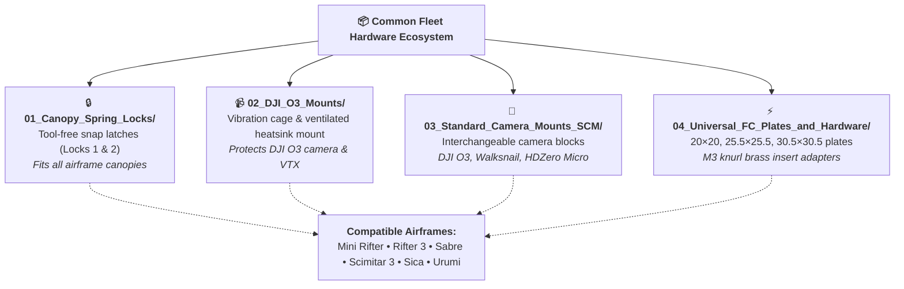

# 📦 Common Hardware & Universal Accessories

[](#)
[](#)
[](https://www.rcgroups.com/forums/showthread.php?4223695-Rifter-Sabre-Scimitar-mini-sized-FPV-cruisers)

> This directory contains shared components, modular camera bays, and standardized retention mechanisms utilized across the entire **AeroBlades** cruiser fleet (**Mini Rifter**, **Rifter 3**, **Sabre**, **Scimitar 3**, **Sica**, and **Urumi**).

---

## 📸 Overview Asset


---

## 🧰 Modular Components Catalog



### 1. 🔒 Canopy Spring Locks (`01_Canopy_Spring_Locks/`)
* **`Canopy spring Lock 1.3mf` & `2.3mf`**: Standardized tool-free snap-latch mechanism used across canopies on all airframes.
* **Print Settings**: 100% infill in durable PLA+ or PETG for spring flex resistance.

### 2. 📹 DJI O3 Air Unit Ecosystem (`02_DJI_O3_Mounts/`)
* **`DJI O3 cage 1.3mf` & `2.3mf`**: Vibration-dampened structural cage protecting the DJI O3 camera module.
* **`DJI O3 VTX mount.3mf`**: Secure ventilated bracket for mounting the DJI O3 air unit heatsink.

### 3. 🎥 Standard Camera Mount (SCM) (`03_Standard_Camera_Mounts_SCM/`)
* **`DJI O3 Cam mount.3mf`, `HDZero Micro Cam mount.3mf`, `Walksnail Cam mount.3mf`**: Interchangeable mounting blocks for modern HD digital FPV cameras.
* **`CAD_Source_Fusion/DJI O3 Camera.f3d`**: Parametric Fusion 360 source model for custom camera housing design.

### 4. ⚡ Universal Flight Controller Trays & Hardware (`04_Universal_FC_Plates_and_Hardware/`)
* **`FC plate 1.3mf`, `2.3mf`, `3.3mf`, `4 24x30.3mf`**: Universal mounting trays for 20x20mm, 25.5x25.5mm, and 30.5x30.5mm flight controllers and 4-in-1 ESCs.
* **`M3 knurl.3mf`**: Press-fit threaded knurl insert adapters for standard M3 standoffs.

---

## 📂 Directory Structure

```
Common/
├── README.md
├── 3D_Print_Files/
│   ├── 01_Canopy_Spring_Locks/               # Tool-free snap latches
│   ├── 02_DJI_O3_Mounts/                     # DJI O3 cage & VTX bracket
│   ├── 03_Standard_Camera_Mounts_SCM/        # DJI O3, HDZero, Walksnail mounts
│   └── 04_Universal_FC_Plates_and_Hardware/  # FC plates 1-4, M3 knurl
├── CAD_Source_Fusion/                        # Parametric Fusion 360 camera models
└── media/                                    # Overview diagram
```

[⬅️ Back to Unified Fleet Catalog](../../CATALOG.md)
