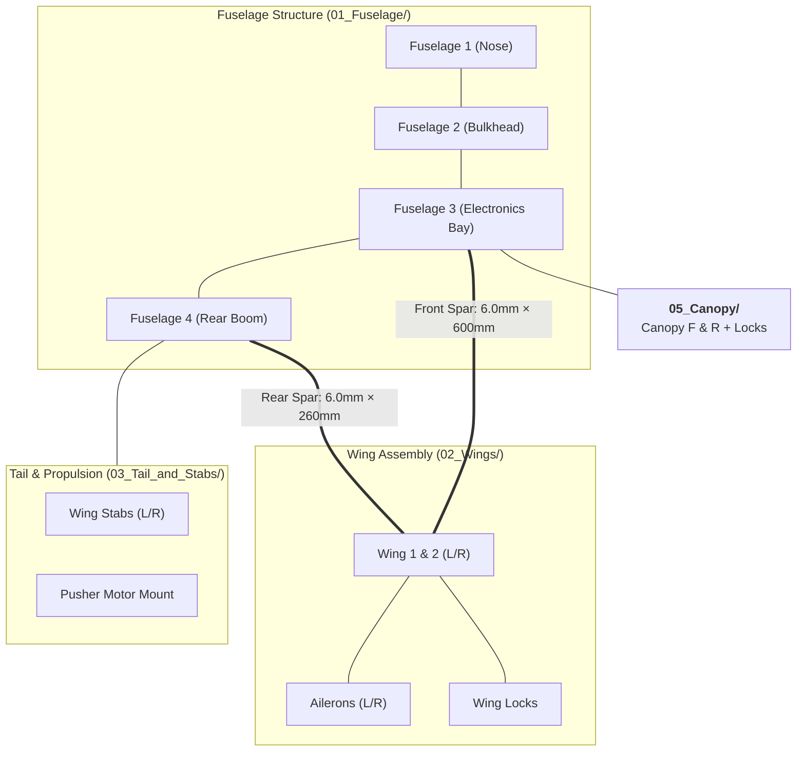

# 🛩️ Mini Rifter: Ultra-Compact FPV Cruiser

[](#)
[](#)
[](#)
[](https://www.rcgroups.com/forums/showthread.php?4223695-Rifter-Sabre-Scimitar-mini-sized-FPV-cruisers)

> **Mini Rifter** is a scaled-down, ultra-portable edition of the Rifter cruiser platform. It features an aerodynamically refined pusher configuration, high efficiency, and docile cruising capabilities on small battery packs.

---

## 📸 Aircraft Gallery

| Top View | Front View |
| :---: | :---: |
|  |  |
| **Side Profile** | **Disassembled Airframe & Parts** |
|  |  |

---

## ⚡ Specifications & Engineering Data

| Parameter | Specification | Notes |
| :--- | :--- | :--- |
| **Airframe Configuration** | Conventional single-motor pusher cruiser | Clean laminar flow nose |
| **Total Printed Weight** | **314 g** | Standard PLA+ / LW-PLA setup |
| **Total Print Time** | **19 hours 18 minutes** | Bambu Lab P1P / P1S reference |
| **Carbon Spars Required** | **Front Spar:** 6.0 mm × 600 mm<br>**Rear Spar:** 6.0 mm × 260 mm | Hollow carbon fiber tubes |
| **Control Surfaces** | 2 Ailerons + V-tail / Stabs | Driven by sub-micro/9g servos |
| **Recommended Propulsion** | 1806 – 2204 brushless motor, 4"–5" prop | Efficient rear pusher mount |
| **Battery Compatibility** | 3S 18650 Li-ion pack or 3S/4S 1300–1500mAh LiPo | Fits forward battery bay |
| **FPV System Support** | Analog, Walksnail Avatar, DJI O3 Air Unit | Standard & External O3 mounts included |



---

## 🖨️ 3D Printing Bill of Materials (ODS Data)

| Part Name | Category Folder | Profile | Infill % / Type | Print Time (P1P) | Weight (g) | Slicing Modifiers |
| :--- | :--- | :---: | :---: | :---: | :---: | :--- |
| **Fuselage 1** | `01_Fuselage/` | C | 0% | 00:21 | 7 | Nose section |
| **Fuselage 2** | `01_Fuselage/` | C | 100% Solid | 00:05 | 2 | Forward bulkhead |
| **Fuselage 3** | `01_Fuselage/` | A | 6% Gyroid | 02:42 | 35 | Electronics bay |
| **Fuselage 4** | `01_Fuselage/` | A | 6% Gyroid | 03:05 | 46 | Rear fuselage & boom |
| **F3F4 pins** | `01_Fuselage/` | C | 100% Solid | - | - | Alignment pins |
| **Wing L 1 / R 1** | `02_Wings/` | A | 4% Gyroid | 01:12 each | 24 each | 1 wall, 3 top/bottom |
| **Wing L 2 / R 2** | `02_Wings/` | A | 4% Gyroid | 03:19 each | 43 each | +Support required |
| **Wing Ailerons 1 & 2** | `02_Wings/` | A | 6% Gyroid | 00:27 each | 10 each | 15 bottom layers |
| **Wing locks L & R** | `02_Wings/` | C | 0% | 00:34 | 13 | 4 walls, +support |
| **Wing L & R Stabs** | `03_Tail_and_Stabs/` | B | 6% Gyroid | 00:25 each | 13 each | 2 bottom, 2 top |
| **Motor mount** | `03_Tail_and_Stabs/` | C | 100% Solid | 00:08 | 5 | Align flat to plate |
| **Battery plate** | `04_Internal_Plates/` | C | 10% Gyroid | 00:19 | 10 | 3 bottom, 3 top |
| **Hinges (TPU)** | `04_Internal_Plates/` | B | 100% Solid | 00:10 | 1 | Flexible 95A TPU |
| **Canopy F** | `05_Canopy/` | C LW | 10% Gyroid | 00:25 | 5 | Foaming PLA-LW (2 b/t, 4 walls) |
| **Canopy R** | `05_Canopy/` | C LW | 10% Gyroid | 00:29 | 6 | Foaming PLA-LW (2 b/t, 4 walls) |
| **Canopy locks** | `05_Canopy/` | C | 0% | 00:14 | 4 | - |
| **Total** | - | - | - | **19:18** | **314 g** | - |

---

## 📂 Project Directory Structure

```
Mini_Rifter/
├── README.md
├── Mini Rifter.ods
├── 3D_Print_Files/
│   ├── 01_Fuselage/           # Fuselage 1, 2, 3, 4, F3F4 pins
│   ├── 02_Wings/              # Wing L/R 1 & 2, Ailerons 1 & 2, Wing locks
│   ├── 03_Tail_and_Stabs/     # Wing L/R Stabs, Motor mount
│   ├── 04_Internal_Plates/    # Battery plate, TPU hinges
│   ├── 05_Canopy/             # Canopy F, Canopy R, Canopy locks
│   └── Extras/                # SCM nose, no-holes nose, wingtips, external DJI O3 pod
├── CAD_Source_STEP/           # 16 complete CAD STEP models
└── media/
    ├── aircraft_photos/       # High-res photos of assembled Mini Rifter
    └── slicer_placement/      # 9 slicer bed orientation photos
```

---

## 🎬 Video Flight Logs
* 🎥 [Rifter Mini Flight Demonstration](https://www.youtube.com/watch?v=fl-8yHl3snQ) by Olivier_C

[⬅️ Back to Unified Fleet Catalog](../../CATALOG.md)
