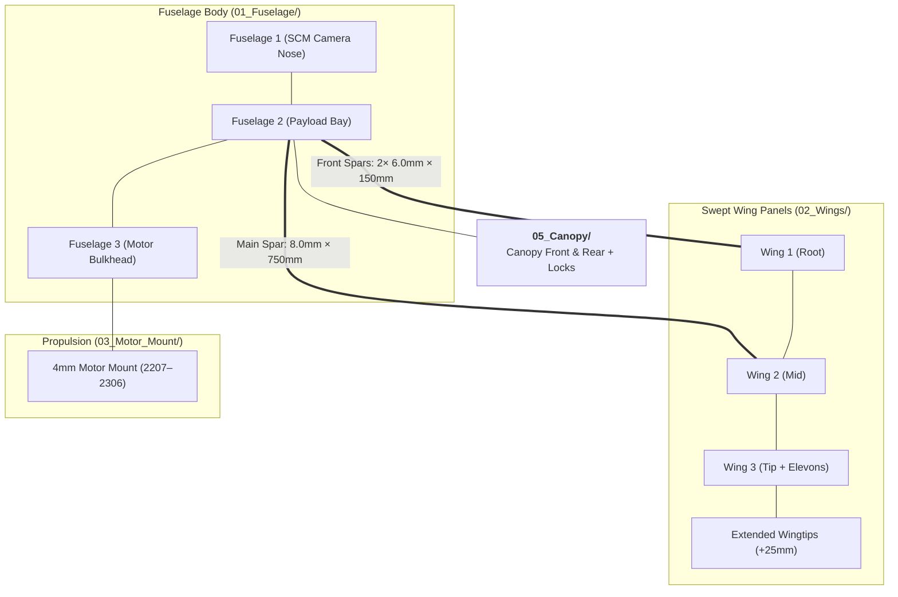

# 🦅 Scimitar 3: Swept-Wing FPV Flying Wing

[](#)
[](#)
[](#)
[](https://www.rcgroups.com/forums/showthread.php?4223695-Rifter-Sabre-Scimitar-mini-sized-FPV-cruisers)

> **Scimitar 3** is a high-performance 3D-printed swept flying wing powered by a central pusher motor. Engineered for clean laminar airflow, fast cruise speeds, and high aerobatic agility with zero fuselage drag.

---

## 📸 Aircraft Gallery

| Top View | Front View |
| :---: | :---: |
|  |  |
| **Side Profile** | **Disassembled Airframe & Parts** |
|  |  |

---

## ⚡ Specifications & Engineering Data

| Parameter | Specification | Notes |
| :--- | :--- | :--- |
| **Airframe Configuration** | Swept flying wing with central pusher motor | Pure flying wing aerodynamics |
| **Total Printed Weight** | **438 g** | Standard PLA+ / LW-PLA setup |
| **Total Print Time** | **21 hours 02 minutes** | Bambu Lab P1P / P1S reference |
| **Carbon Spars Required** | **Main Wing Spar:** 8.0 mm × 750 mm<br>**Front Spars:** 2x 6.0 mm × 150 mm | Rigid swept spar structure |
| **Control Surfaces** | 2 Elevons | Pitch & roll combined mixer |
| **Recommended Propulsion** | 2207 – 2306 brushless motor, 5"–6" prop | High-thrust central pusher |
| **Battery Compatibility** | 4S 1500–2200mAh LiPo or 4S 18650 Li-ion pack | Central battery bay |
| **FPV System Support** | Analog, Walksnail Avatar, DJI O3 Air Unit | SCM camera mount & O3 compatibility |



---

## 🖨️ 3D Printing Bill of Materials (ODS Data)

| Part Name | Category Folder | Profile | Infill % / Type | Print Time (P1P) | Weight (g) | Slicing Modifiers |
| :--- | :--- | :---: | :---: | :---: | :---: | :--- |
| **Fuselage 1** | `01_Fuselage/` | B | 0% | 00:44 | 19 | Standard nose |
| **Fuselage 1 SCM** | `01_Fuselage/` | B | 0% | 00:44 | 19 | Camera nose bay |
| **Fuselage 2** | `01_Fuselage/` | A | 4% Gyroid | 03:06 | 73 | Center payload bay |
| **Fuselage 3** | `01_Fuselage/` | A | 4% Gyroid | 03:09 | 80 | Motor mount bulkhead |
| **Wing L/R 1** | `02_Wings/` | A | 4% Gyroid | 00:49 each | 20 each | 1 wall, 3 top/bottom |
| **Wing L/R 2** | `02_Wings/` | A | 5% Gyroid | 02:59 each | 53 each | +Support required |
| **Wing L/R 3** | `02_Wings/` | A | 5% Gyroid | 00:54 each | 21 each | Wingtip section |
| **Wing Ailerons / Elevons**| `02_Wings/` | A | 6% Gyroid | 01:38 | 21 | 12 bottom layers |
| **Wing Locks** | `02_Wings/` | C | 100% Solid | 00:35 | 15 | 5 walls |
| **Motor mount 4mm** | `03_Motor_Mount/` | C | 100% Solid | 00:10 | 3 | Solid retention |
| **Battery plate** | `04_Internal_Plates/` | C | 10% Gyroid | 00:40 | 18 | 3 bottom, 3 top layers |
| **FC plate** | `04_Internal_Plates/` | C | 10% Gyroid | - | - | Stacking tray |
| **Hinges (TPU)** | `04_Internal_Plates/` | B | 100% Solid | 00:10 | 1 | Flexible 95A TPU |
| **Canopy F+R** | `05_Canopy/` | C LW | 10% Gyroid | 01:12 | 16 | Foaming LW-PLA (4 walls, 2 b/t) |
| **Canopy locks** | `05_Canopy/` | C | 0% | 00:14 | 4 | - |
| **Total** | - | - | - | **21:02** | **438 g** | - |

---

## 📂 Project Directory Structure

```
Scimitar_3/
├── README.md
├── Scimitar3.ods
├── 3D_Print_Files/
│   ├── 01_Fuselage/           # Fuselage 1, 1 SCM, 2, 3
│   ├── 02_Wings/              # Wings 1-3 (L/R), Ailerons, Wing locks
│   ├── 03_Motor_Mount/        # Motor mount 4mm
│   ├── 04_Internal_Plates/    # Battery plate, FC plate, TPU hinges
│   ├── 05_Canopy/             # Canopy F & R, Canopy locks
│   └── Extras/                # Extended wingtips (+25mm), centering pin, text canopy
├── CAD_Source_STEP/           # 10 complete CAD STEP models
└── media/
    ├── aircraft_photos/       # High-res photos of assembled Scimitar 3
    └── slicer_placement/      # 11 slicer bed orientation photos
```

---

## 🎬 Video Flight Logs
* 🎥 [Scimitar: 3D-Printed Flying Wing](https://www.youtube.com/watch?v=LZn1OF9eK5k) by Olivier_C

[⬅️ Back to Unified Fleet Catalog](../../CATALOG.md)
