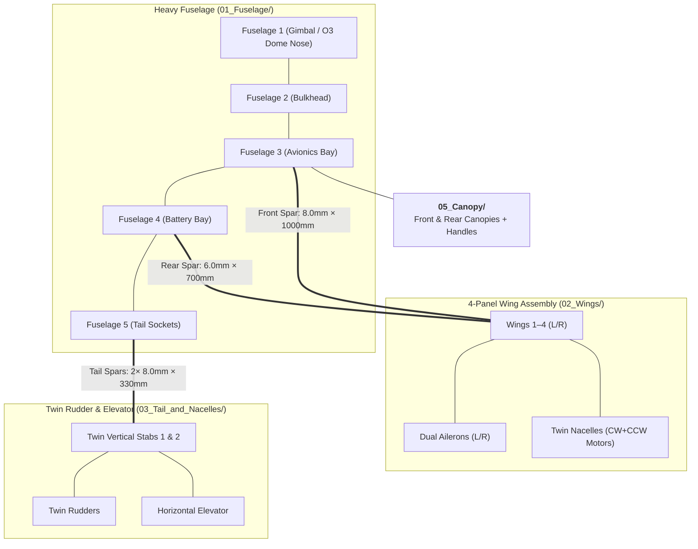

# ⚔️ Sica: Long-Range Twin-Tractor FPV Cruiser

[](#)
[](#)
[](#)
[](https://www.rcgroups.com/forums/showthread.php?4223695-Rifter-Sabre-Scimitar-mini-sized-FPV-cruisers)

> **Sica** is the flagship heavy long-range cruiser of the fleet. Featuring twin forward tractor motors, a generous fuselage payload cabin, twin vertical stabilizers, and full night-flight COB LED internal channels, Sica is the ultimate endurance platform.

---

## 📸 Aircraft Gallery

| Top View | Front View |
| :---: | :---: |
|  |  |
| **Side Profile** | **Disassembled Airframe & Parts** |
|  |  |

---

## ⚡ Specifications & Engineering Data

| Parameter | Specification | Notes |
| :--- | :--- | :--- |
| **Airframe Configuration** | Twin-motor tractor cruiser with twin rudders & elevator | Heavy payload cruiser |
| **Total Printed Weight** | **746 g** | Standard PLA+ setup |
| **Total Print Time** | **39 hours 59 minutes** | Bambu Lab P1P / P1S reference |
| **Carbon Spars Required** | **Front Wing Spar:** 8.0 mm × 1000 mm (can be cut to 800 mm)<br>**Rear Wing Spar:** 6.0 mm × 700 mm<br>**Tail Stabilizer Spars (2x):** 8.0 mm × 330 mm | High rigidity heavy airframe |
| **Control Surfaces** | 2 Ailerons, 2 Vertical Rudders, 1 Horizontal Elevator | Full 4-axis flight authority |
| **Recommended Propulsion** | 2x 2207 – 2806.5 brushless motors, 6"–7" props | Massive endurance & speed envelope |
| **Battery Compatibility** | 4S 21700 4000–8000mAh Li-ion pack or large 4S LiPo | Massive central battery bay |
| **FPV & Payload Support** | DJI O3 1-axis pan/tilt dome, HEQ G-Port gimbal, COB LEDs | Dedicated gimbal & O3 dome noses |



---

## 🖨️ 3D Printing Bill of Materials (ODS Data)

| Part Name | Category Folder | Profile | Infill % / Type | Print Time (P1P) | Weight (g) | Slicing Modifiers |
| :--- | :--- | :---: | :---: | :---: | :---: | :--- |
| **Fuselage 1** | `01_Fuselage/` | C | 0% | 00:38 | 14 | Nose bay |
| **Fuselage 2** | `01_Fuselage/` | C | 100% Solid | 00:09 | 4 | Forward bulkhead |
| **Fuselage 3** | `01_Fuselage/` | A | 6% Gyroid | 02:14 | 31 | Avionics bay |
| **Fuselage 4** | `01_Fuselage/` | A | 6% Gyroid | 02:25 | 40 | Battery bay |
| **Fuselage 5** | `01_Fuselage/` | A | 6% Gyroid | 02:17 | 26 | Rear fuselage & tail mount |
| **Wing L/R 1** | `02_Wings/` | A | 3% Gyroid | 02:09 / 02:35 | 49 / 57 | +Support required |
| **Wing L/R 2** | `02_Wings/` | A | 3% Gyroid | 02:09 / 02:35 | 49 / 57 | +Support required |
| **Wing L/R 3** | `02_Wings/` | A | 3% Gyroid | 03:29 each | 57 each | Wing middle section |
| **Wing L/R 4** | `02_Wings/` | A | 6% Gyroid | 00:50 each | 12 each | Wingtip section |
| **Wing Ailerons 1 & 2** | `02_Wings/` | A | 6% Gyroid | 01:51 | 23 | 13 bottom layers |
| **Wing locks L & R** | `02_Wings/` | C | 10% Gyroid | 00:41 | 26 | 5 walls |
| **Nacelles L & R** | `03_Tail_and_Nacelles/` | C | 6% Gyroid | 00:49 each | 33 each | Twin tractor motor nacelles |
| **Motor mounts L & R** | `03_Tail_and_Nacelles/` | C | 100% Solid | 01:07 | 34 | Solid screw retention |
| **Stab 1** | `03_Tail_and_Nacelles/` | A | 3% Gyroid | 01:13 | 22 | +Support required |
| **Stab 2 L & R** | `03_Tail_and_Nacelles/` | B | 3% Gyroid | 00:53 | 33 | +Support required |
| **Rudders L & R** | `03_Tail_and_Nacelles/` | A | 6% Gyroid | 01:45 each | 14 each | Twin vertical rudders |
| **Elevator L & R** | `03_Tail_and_Nacelles/` | A | 5% Gyroid | 01:58 | 15 | 13 bottom layers |
| **Battery plate** | `04_Internal_Plates/` | C | 10% Gyroid | 00:21 | 11 | 3 bottom, 3 top layers |
| **Hinges (TPU)** | `04_Internal_Plates/` | B | 100% Solid | 00:10 | 1 | Flexible 95A TPU |
| **Canopy Front** | `05_Canopy/` | C | 6% Gyroid | 00:25 | 13 | 2 bot, 2 top, 5 walls |
| **Canopy Rear** | `05_Canopy/` | C | 6% Gyroid | 00:18 | 8 | 2 bot, 2 top, 5 walls |
| **Canopy handle** | `05_Canopy/` | B | 100% Solid | 00:05 | 1 | Quantity: 2 |
| **Total** | - | - | - | **39:59** | **746 g** | - |

---

## 📂 Project Directory Structure

```
Sica/
├── README.md
├── Sica.ods
├── 3D_Print_Files/
│   ├── 01_Fuselage/           # Fuselage 1-5
│   ├── 02_Wings/              # Wings 1-4 (L/R), Ailerons 1 & 2 (L/R), Wing locks
│   ├── 03_Tail_and_Nacelles/  # Nacelles, Motor mounts, Stabs 1 & 2, Rudders, Elevators
│   ├── 04_Internal_Plates/    # Battery plate, TPU hinges
│   ├── 05_Canopy/             # Canopy Front & Rear, Canopy handles
│   └── Extras/                # HEQ G-Port gimbal, O3 Pan/Tilt dome, COB LED suites
├── CAD_Source_STEP/           # 21 individual STEP files + full Sica v243 assembly STEP
└── media/
    ├── aircraft_photos/       # High-res photos of assembled Sica
    └── slicer_placement/      # 20 slicer bed orientation photos
```

---

## 🎬 Video Flight Logs
* 🎥 [New Twin Tractor (Sica Introduction)](https://www.youtube.com/watch?v=HihsU5iFMYI) by Olivier_C
* 🎥 [Neon Nights (Sica Full COB LED Night Flight)](https://www.youtube.com/watch?v=hPF_NwX6mRE) by Olivier_C

[⬅️ Back to Unified Fleet Catalog](../../CATALOG.md)
