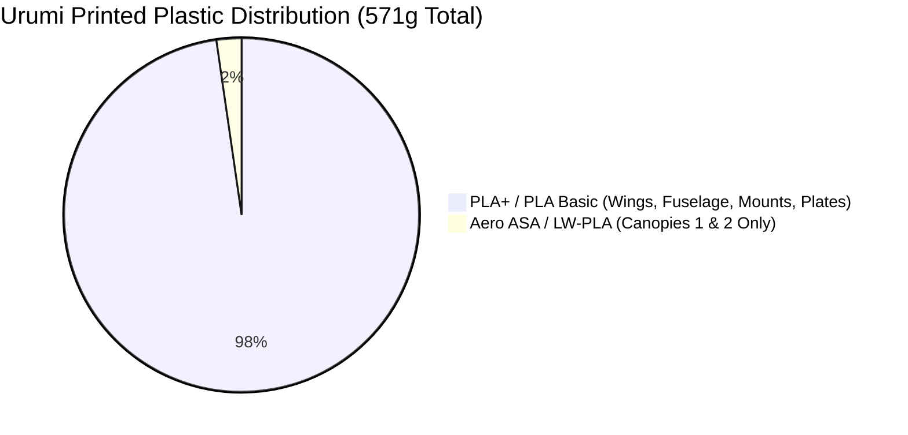

# 🔩 Hardware Parts, Mechanical Structure & Materials Guide

> **Urumi VTOL Hybrid** — Complete specifications for structural carbon fiber spars, fasteners, adhesives, 3D-printed airframe components, and filament mechanical properties.

---

## 1. Structural Carbon Fiber Backbone

The central structural strength of Urumi relies on an **X-shaped internal carbon-fiber frame** that ties the fuselage, wings, and motor nacelles into a single rigid assembly.

```
                    [Front-Left Motor]             [Front-Right Motor]
                             \                     /
                              \   6.0 x 284mm     /
                               \  Carbon Spar    /
                                +---------------+
                                |   FUSELAGE    |
                                +---------------+
                               /  Carbon Spar    \
                              /   6.0 x 284mm     \
                             /                     \
                    [Rear-Left Motor]              [Rear-Right Motor]
```

### 1.1 Carbon Tube Specifications
* **Quantity Required**: **4 pieces**
* **Outer Diameter (OD)**: **6.0 mm** (±0.05 mm tolerance)
* **Length**: **284.0 mm**
* **Inner Diameter (ID)**: ~4.0 mm (hollow pultruded carbon fiber tubing)
* **Wall Thickness**: ~1.0 mm
* **Weight**: ~11.5 grams per tube (~46 grams total for all 4 spars)

### 1.2 Cutting & Preparation Tips
1. Carbon fiber tubes are typically sold in 500mm or 1000mm lengths. Measure and mark exactly **284 mm**.
2. **Prevent Splintering**: Wrap a strip of blue painter's tape tightly around the cut line.
3. **Cutting**: Use a rotary tool (Dremel) with a thin abrasive diamond or fiberglass cut-off wheel. Cut at medium speed while wearing an N95/FFP2 dust mask.
4. **Deburring**: Lightly chamfer the outer edge using 320-grit sandpaper so the tube slides smoothly into the 3D-printed channels without catching.

---

## 2. Fasteners, Screws & Mechanical BOM

All hardware on Urumi uses standard metric fastener sizes.

| Component / Subsystem | Fastener Type & Dimensions | Quantity | Material & Specification | Function |
| :--- | :--- | :---: | :--- | :--- |
| **Motor Mounting** | **M3 × 6 mm or 8 mm** Socket/Button Head | **16x** | Grade 10.9/12.9 Steel or Stainless | Secures 4x brushless motors to `Motor mount 1-4` (4 screws per motor). Must use Blue Loctite! |
| **Central Avionics Stack** | **M3 × 20 mm or 25 mm** Pan/Socket Head | **4x** | Steel / Stainless | Secures 4-in-1 ESC and Flight Controller onto `FC Plate`. |
| **Avionics Standoffs** | **M3 Nylon Standoffs (5mm–6mm)** | **8x** | M3 Nylon | Spacing between ESC and Flight Controller to prevent shorts and heat transfer. |
| **Stack Nuts** | **M3 Nyloc Nuts** | **4x** | Nylon-insert locking nuts | Locks the top of the FC stack screws against vibration. |
| **Tilt Servo Mounting** | **M2 × 8 mm** Pan Head (or Self-tapping) | **2x** | Steel | Secures the 9g metal-gear servo into `Servo Plate` (27.6mm screw spacing). |
| **FPV Camera Cage** | **M2 × 4 mm or 6 mm** Socket Head | **4x** | Stainless Steel | Secures camera side brackets into `Camera mount` (20.2mm bracket width). |
| **Battery Retention** | **20 mm × 200 mm or 250 mm Strap** | **1x** | Rubberized non-slip Velcro | Retains 4S/6S LiPo or 4S 21700 pack on `Battery Plate`. |
| **Battery Pad** | **Adhesive Silicone / Foam Pad** | **1x** | 2mm–3mm thickness | Placed on `Battery Plate` to eliminate battery sliding during vertical takeoff. |
| **Anti-Vibration Dampers**| **M3 Silicone Rubber Bobbins** | **4x** | Molded silicone grommets | Isolates flight controller gyros from motor vibrations. |

---

## 3. Adhesives, Chemicals & Assembly Consumables

* **Cyanoacrylate (Medium CA Glue)**:
  * *Recommended*: **Bob Smith Industries Insta-Cure+** or **Gorilla Super Glue (Blue Cap)**.
  * *Role*: Joining fuselage mating bulkheads (`Fuselage 1-4`). Medium viscosity fills minor layer gaps and provides strong shear bonding on PLA.
* **CA Accelerator / Activator Spray**:
  * *Recommended*: **Bob Smith Industries Insta-Set**.
  * *Role*: Instantly cures CA glue within 2 seconds. Apply glue to one side, assemble, and mist the joint with activator.
* **Threadlocker (Blue Loctite 242)**:
  * *Role*: Medium-strength, removable anaerobic threadlocker.
  * ⚠️ **Mandatory**: Apply one small drop to every M3 motor screw. Motor vibration will loosen untreated screws within 2–3 flights.
* **Epoxy (Optional 5-Minute Epoxy)**:
  * Useful for bonding carbon tubes inside `Fuselage 2` and `Fuselage 3` if additional rigidity is desired.

---

## 4. 3D-Printed Parts Breakdown & Modular Locking System

### 4.1 Airframe Components Summary

| Subsystem | Included Files | Target Filament | Notes & Function |
| :--- | :--- | :--- | :--- |
| **Fuselage Core** | `Fuselage 1.3mf` (Nose)<br>`Fuselage 2.3mf`<br>`Fuselage 3.3mf`<br>`Fuselage 4.3mf` (Tail) | **PLA+ / PLA Basic** | Glued together with CA glue. Contains internal channels for 6mm carbon spars and gear bays. |
| **Aerofoil Wings** | `Wing 1-2.3mf` (Top Wings)<br>`Wing 3-4.3mf` (Bottom Wings) | **PLA+ / PLA Basic** | 4 wings angled at 22°. Mirrored left-to-right in slicer. Slide directly onto carbon spars. |
| **Propulsion Nacelles**| `Nacelle 1-2.3mf`<br>`Nacelle 3-4.3mf` | **PLA+ / PETG** | Aerodynamic nacelles at wingtips; house motor wiring. |
| **Motor Mounts** | `Motor mount 1-2-3-4.3mf` | **PLA+ (100% Solid)** | **Must be printed with 100% infill** for motor torque handling. |
| **Landing Feet** | `Pad 1.3mf`, `Pad 2.3mf`<br>`Pad 3.3mf`, `Pad 4.3mf` | **PLA+ / PETG** | Snap onto the bottom of each nacelle to absorb landing impact. |
| **Internal Plates** | `Battery Plate.3mf`<br>`FC Plate.3mf`<br>`Servo Plate.3mf`<br>`Camera mount.3mf` | **PLA+ / PLA Basic** | Internal structural gear trays for electronics and camera tilt. |
| **Access Canopies** | `Canopy 1.3mf`<br>`Canopy 2.3mf`<br>`Canopy locks.3mf` | **Foaming LW-PLA / ASA-Aero** (or PLA Basic) | Quick-release battery hatch and maintenance canopy. |

### 4.2 Glueless Removable Wing Locking Mechanism
Unlike earlier prototypes where wings had to be glued permanently to the fuselage, this version uses a **modular glueless slide-lock system**:
1. The wings slide freely over the 6.0mm carbon fiber spars.
2. The root of each wing slips into a recessed alignment socket in the fuselage.
3. The outer motor mounts (`Motor mount 1-4`) act as the retention stop: once bolted into place, they trap the wing securely between the fuselage and the motor nacelle.
4. **Crash Repair Advantage**: If a wing is cracked in a rough landing, simply unbolt the outer motor mount, slide off the broken wing, slide on a fresh 3D-printed spare, and re-tighten.

### 4.3 Alternate Tolerance Parts (`3D_Print_Files/Extras/`)
* **`Motor mount 1-2-3-4.tighter by 05mm.3mf`**:
  * Features a **0.05 mm tighter inner bore** on the carbon spar hole.
  * **When to use**: If your carbon fiber tubes measure slightly under 6.0mm (e.g. 5.92mm), or if you print in ABS (which shrinks by 1%–1.5%), test this tighter version to ensure zero slop on the spar.

---

## 5. Filament Selection & Mechanical Analysis

### 5.1 The Lightweight Filament Reality
* **558 grams out of 571 grams total plastic (97.7%) is printed in standard PLA / PLA+!**
* **Only the two small canopies (`Canopy 1` = 8g and `Canopy 2` = 5g, total 13g) were originally sliced for Foaming LW-PLA.**



### 5.2 Mechanical Evaluation for Bambu Lab P1S

| Filament | Suitability | Tensile & Torsional Rigidity | Recommended Use Case |
| :--- | :--- | :--- | :--- |
| **Bambu PLA Basic / PLA+** | ⭐ **Recommended (Primary)** | **Very High** (Stiff, high dimensional accuracy) | **All structural parts**: Fuselage, wings, motor mounts, landing pads, and plates. Can also print canopies (adds only ~8g). |
| **ASA-Aero** | ✅ **Optional (Selective)** | **Low** (Foaming micro-cellular structure) | **Canopy 1 & Canopy 2 ONLY**. ⚠️ Never use for motor mounts or wing locking joints (insufficient shear strength). |
| **ABS** | ⚠️ **Advanced Option** | **High** (~16% lighter than PLA, heat resistant) | Fuselage & wings for enclosed P1S printers. Watch for 1%–1.5% shrinkage on 6.0mm carbon spar holes. |
| **PETG** | 🟢 **Alternative** | **Medium-High** (Excellent impact resistance) | Ideal for `Nacelle 1-4` and `Pad 1-4` to handle rough grass landings without snapping. |
| **PLA Silk+** | ❌ **DO NOT USE** | **Poor** (Weak inter-layer bonding) | **Never use for structural aircraft parts**. Delaminates under flight aerodynamic loads. |

---

## 6. Workshop Tools & Assembly Equipment List

* **Hex Screwdrivers**: 1.5 mm (for M2 screws), 2.0 mm (for M3 screws), and 2.5 mm.
* **Rotary Tool (Dremel)**: With fiberglass cut-off wheel for cutting carbon fiber tubing.
* **6.0 mm Round File / Drill Bit**: For gently clearing carbon spar channels if tight.
* **Digital Calipers**: For measuring carbon spar OD and checking airframe symmetry.
* **Soldering Station**: 60W–80W iron with chisel tip, 60/40 rosin-core solder, flux pen, and heat-shrink tubing.
* **Digital Gram Scale**: For verifying part print weights against the master table in [`docs/03_PRINT_GUIDE_AND_PROFILES.md`](03_PRINT_GUIDE_AND_PROFILES.md).
